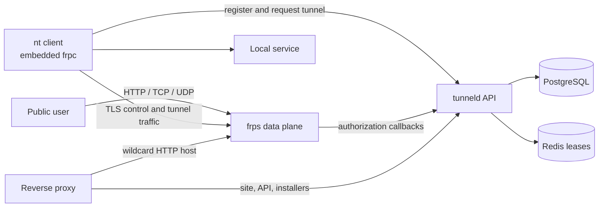

# NodeLane Tunnel

NodeLane Tunnel is a lightweight tunnel service built around the official
[frp](https://github.com/fatedier/frp) client and server. It combines a Go
control plane, a cross-platform `nt` client, and a localized website to expose
local HTTP, TCP, or UDP services through a public endpoint.

The hosted service is available at [tunnel.nodelane.net](https://tunnel.nodelane.net/).
HTTP tunnels use addresses such as `http://<slug>.tunnel.nodelane.net`.

> NodeLane Tunnel is intended for development, testing, demonstrations, and
> short-lived collaboration. Do not expose databases, administrative panels,
> or services containing sensitive data. The hosted service does not provide a
> production SLA.

## Highlights

- One interactive command for HTTP, TCP, and UDP tunnels
- Anonymous device identity; no account is required
- Automatic HTTP subdomains and TCP/UDP port allocation
- Per-client and per-network tunnel limits, expiry, and administrative bans
- Tunnel-scoped signed credentials validated by the frps HTTP plugin
- Embedded frp `0.70.0` client; no separate `frpc` installation
- Linux and Windows packages for AMD64 and ARM64
- SHA-256 package verification, atomic upgrades, and one-version rollback
- Localized CLI and website in 12 languages
- PostgreSQL-backed state and Redis-backed distributed leases
- Container image with the website and all client release assets included

## Quick start

Start a local service first, then run the installer for your platform.

Linux:

```sh
curl -fsSL https://tunnel.nodelane.net/run.sh | sh
```

Windows PowerShell:

```powershell
irm https://tunnel.nodelane.net/run.ps1 | iex
```

Windows CMD:

```bat
curl -fsSL https://tunnel.nodelane.net/run.cmd | cmd
```

The installer downloads the current `nt` package, verifies its SHA-256 digest
and embedded version, updates the launcher atomically, and opens an interactive
form. Choose a protocol, enter a local host, and enter a port. An empty host is
normalized to `localhost`; the initial port is `3000`.

After installation, run `nt` again for the interactive form or provide all
three positional arguments for a non-interactive tunnel:

```sh
nt http localhost 3000
nt tcp localhost 22
nt udp localhost 5353
```

Useful commands:

```sh
nt help
nt version
nt languages
nt --lang zh-CN http localhost 3000
```

Press `Ctrl+C` to close the tunnel. HTTP sessions print request time, source
address, method, and URL. TCP and UDP sessions show connection and byte counts.

### Client configuration

| Variable | Purpose | Default |
| --- | --- | --- |
| `NT_API_URL` | Control-plane API base URL | `https://tunnel.nodelane.net/api/v1` |
| `NT_LANG` | CLI locale, or `auto` | Operating-system locale |
| `NT_CREDENTIALS_FILE` | Anonymous client credential file | Platform user config directory |
| `NT_CA_FILE` | Custom CA bundle for the frp TLS connection | System trust/default frp behavior |
| `NT_FRP_PROXY_URL` | Proxy URL for the frp control connection | Unset |
| `NT_FRP_LOG` | Set to `1` to stream embedded frp logs | Unset |
| `NT_FRP_LOG_LEVEL` | `trace`, `debug`, `info`, `warn`, or `error` | `info` |
| `NO_COLOR` | Disable styled terminal output when set | Unset |

`--lang` overrides `NT_LANG`. On Unix-like systems, `LC_ALL`, `LC_MESSAGES`,
and `LANG` are used when `NT_LANG` is unset.

## Architecture



The repository contains two executables:

- `tunneld` serves the website, client installers, release assets, public API,
  frps authorization plugin, health check, and loopback-only administration API.
- `nt` registers an anonymous client, requests a tunnel, starts the embedded
  frp client, and presents tunnel activity in the terminal.

frps remains the data plane. NodeLane Tunnel does not maintain a second proxy
protocol or installer engine.

## Self-hosting

### Requirements

- A Linux AMD64 or ARM64 host
- Docker Engine with Compose v2; Buildx is required for multi-platform images
- frps `0.70.0`
- PostgreSQL and Redis
- A base hostname and matching wildcard DNS record pointing to the host
- A reverse proxy capable of preserving the original wildcard `Host` header
- Firewall access for the frps control port and the configured TCP/UDP ranges

The supplied Compose files use host networking. PostgreSQL, Redis, frps, the
reverse proxy, and `tunneld` can therefore communicate through loopback without
sharing Docker networks.

### 1. Configure the service

Copy the environment template:

```sh
cp .env.example .env
```

Set at least the following values:

- `PUBLIC_DOMAIN`, `FRP_SERVER_ADDR`, and `FRP_TLS_SERVER_NAME` to the tunnel
  domain you control
- `DATABASE_URL` to an existing PostgreSQL database
- `REDIS_ADDR` and, when enabled, `REDIS_PASSWORD`
- distinct random values for `TOKEN_PEPPER`, `TUNNEL_JWT_SECRET`, and
  `ADMIN_TOKEN`
- one random `FRP_AUTH_TOKEN`, copied to `auth.token` in the frps configuration

For example, `openssl rand -hex 32` produces a suitable 32-byte secret. Run it
separately for each secret; do not reuse one value for multiple settings.

The checked-in reverse-proxy, website, and frps examples use
`tunnel.nodelane.net`. Replace that hostname when building another deployment:

```sh
git grep -n "tunnel.nodelane.net" -- deploy web
```

The generated files under `internal/server/assets/web` are replaced by the
Docker build, so make website changes in `web/` rather than editing generated
HTML directly.

### 2. Configure frps

Use one of these templates:

- `deploy/frps.toml` is a complete frps `0.70.0` example.
- `deploy/frps.additions.toml` lists the settings to merge into an existing
  frps configuration.

The values below must agree between frps and `.env`:

| frps | tunneld |
| --- | --- |
| `bindPort` | `FRP_SERVER_PORT` |
| `auth.token` | `FRP_AUTH_TOKEN` |
| `subDomainHost` | `PUBLIC_DOMAIN` |
| `allowPorts` | `TCP_PORT_*` and `UDP_PORT_*` |
| HTTP plugin address/path | `127.0.0.1:9000/internal/frp` |

Run frps with host networking when the plugin address is loopback. Validate its
configuration before restarting it:

```sh
frps verify -c /path/to/frps.toml
```

Port `7000` must be a raw TCP route to frps. Do not put an HTTP reverse proxy or
an HTTPS health check in front of it.

### 3. Configure ingress

`deploy/Caddyfile` and `deploy/openresty.conf` provide reference routes. Replace
their hostname and certificate placeholders.

| Listener | Destination | Notes |
| --- | --- | --- |
| Main HTTPS hostname | `127.0.0.1:9000` | Website, API, installers, and releases |
| Wildcard HTTP/HTTPS hostname | `127.0.0.1:8080` | Preserve the original `Host` header |
| frps control TCP port | `127.0.0.1:7000` | Raw TCP, not HTTP |
| TCP tunnel range | `20000-29999` | Public TCP listeners by default |
| UDP tunnel range | `30000-39999` | Public UDP listeners by default |

Do not expose `/internal/*`. Keep `9000`, `8080`, PostgreSQL, and Redis bound to
loopback or a trusted management network. If forwarding client IP headers, list
only the reverse proxy's addresses in `TRUSTED_PROXY_CIDRS`.

HTTP tunnel URLs default to `http`. Set `PUBLIC_SCHEME=https` only after the
wildcard hostname has working TLS termination.

### 4. Build and start

Set `TUNNELD_VERSION` in `.env` to the version being deployed, then build the
image and start the control plane:

```sh
docker compose --env-file .env -f deploy/compose.yaml up -d --build
curl -fsS http://127.0.0.1:9000/healthz
docker compose --env-file .env -f deploy/compose.yaml logs --tail=100 tunneld
```

The image build compiles `tunneld`, builds the Astro website, builds all four
`nt` packages, and stores the packages under `/releases`. Database tables and
indexes are created idempotently at startup; the PostgreSQL database and role
must already exist.

To deploy a prebuilt image from any OCI registry, set `TUNNELD_IMAGE` and use:

```sh
docker compose --env-file .env -f deploy/compose.registry.yaml pull
docker compose --env-file .env -f deploy/compose.registry.yaml up -d
```

Publish a multi-platform image with the included scripts. Replace the account,
repository, and version in these examples.

PowerShell:

```powershell
docker login ghcr.io
.\deploy\publish-image.ps1 `
  -Registry ghcr.io `
  -Repository your-account/nodelane-tunneld `
  -Version 0.4.2 `
  -TagStable
```

POSIX shell:

```sh
docker login ghcr.io
sh deploy/publish-image.sh ghcr.io 0.4.2 your-account/nodelane-tunneld
```

No registry credentials are accepted by the scripts; authenticate with Docker
before publishing.

### 5. Point clients to another deployment

The distributed `nt` client defaults to the hosted NodeLane API. Set
`NT_API_URL` for another control plane:

```sh
export NT_API_URL=https://tunnel.example.com/api/v1
nt http localhost 3000
```

The bootstrap scripts also support `NT_RELEASE_BASE` and `NT_BIN_DIR` overrides.
The CMD bootstrap additionally supports `NT_INSTALL_URL`.

## Server configuration

`DEV_MODE=true` supplies development-only secrets and permits in-memory storage.
Never enable it on an Internet-facing instance.

### Runtime and public addresses

| Variable | Default | Description |
| --- | --- | --- |
| `DEV_MODE` | `false` | Enable local development behavior |
| `LISTEN_ADDR` | `:9000` | HTTP control-plane listener |
| `RELEASE_DIR` | unset | Directory exposed at `/releases/` |
| `LOG_LEVEL` | `info` | `debug`, `info`, `warn`, or `error` |
| `PUBLIC_SCHEME` | `http` | Scheme returned for HTTP tunnels |
| `PUBLIC_DOMAIN` | `tunnel.nodelane.net` | Base hostname for generated tunnel URLs |
| `NODE_ID` | `primary` | Node identifier stored with tunnel leases |

### frp

| Variable | Default | Description |
| --- | --- | --- |
| `FRP_SERVER_ADDR` | `tunnel.nodelane.net` | Address returned to clients |
| `FRP_SERVER_PORT` | `7000` | frps control port |
| `FRP_AUTH_TOKEN` | required | Shared frp authentication token |
| `FRP_TLS_SERVER_NAME` | `tunnel.nodelane.net` | Optional TLS server name returned to clients |
| `FRP_BANDWIDTH_LIMIT` | `5MB` | Per-tunnel server-side bandwidth limit |

### Storage, identity, and limits

| Variable | Default | Description |
| --- | --- | --- |
| `DATABASE_URL` | required in production | PostgreSQL connection string |
| `REDIS_ADDR` | required in production | Redis address |
| `REDIS_PASSWORD` | unset | Redis password |
| `REDIS_PREFIX` | `nodelane:tunnel` | Redis key namespace |
| `TOKEN_PEPPER` | required | Pepper for hashed client tokens |
| `TUNNEL_JWT_SECRET` | required, at least 32 bytes | Tunnel credential signing key |
| `ADMIN_TOKEN` | unset | Bearer token for administrative endpoints |
| `TUNNEL_TTL` | `1h` | Tunnel lifetime |
| `MAX_TUNNELS_PER_CLIENT` | `1` | Concurrent tunnels per anonymous client |
| `MAX_TUNNELS_PER_IP` | `2` | Concurrent tunnels per source network |
| `TCP_PORT_START` / `TCP_PORT_END` | `20000` / `29999` | TCP allocation range |
| `UDP_PORT_START` / `UDP_PORT_END` | `30000` / `39999` | UDP allocation range |
| `TRUSTED_PROXY_CIDRS` | unset | Proxies allowed to supply forwarding headers |

## Operations and diagnostics

Check the control plane:

```sh
curl -fsS http://127.0.0.1:9000/healthz
docker compose --env-file .env -f deploy/compose.yaml ps
docker compose --env-file .env -f deploy/compose.yaml logs -f tunneld
```

Every API request receives an `X-Request-ID`. frps callback logs include the
upstream request ID, operation, validation stage, tunnel identifiers, decision,
status, and duration without logging credentials. Use `LOG_LEVEL=debug` for
callback receipt and heartbeat/work-connection details.

If the client reports `yamux: Invalid protocol version: 71`, the first
decrypted byte is usually the `G` from an HTTP `GET`. Verify that the frps
control port is exposed as raw TCP, that no layer-7 proxy or HTTP health check
targets it, and that `transport.protocol` remains `tcp` unless a matching proxy
terminates another transport in front of frps.

If a proxy appears online but rejects every work connection, verify that both
client and server use `auth.additionalScopes = ["HeartBeats", "NewWorkConns"]`
and that frps has the NodeLane HTTP plugin enabled for every listed operation.

## Administrative bans

Administrative routes should be called only through loopback or a trusted
management network.

Ban a client:

```sh
curl -X POST http://127.0.0.1:9000/internal/admin/clients/cli_xxx/ban \
  -H "Authorization: Bearer $ADMIN_TOKEN" \
  -H "Content-Type: application/json" \
  -d '{"reason":"abuse"}'
```

Ban an IPv4 address, IPv6 address, or CIDR range:

```sh
curl -X POST http://127.0.0.1:9000/internal/admin/ip-bans \
  -H "Authorization: Bearer $ADMIN_TOKEN" \
  -H "Content-Type: application/json" \
  -d '{"network":"203.0.113.0/24","scope":"tunnel_client","reason":"abuse"}'
```

## Development

Go `1.27` or newer is required. The website uses Astro `7`, pnpm `10`, and
Node.js `22` or newer; the container build currently uses Node.js `24`.

Run the server with in-memory development state:

```powershell
$env:DEV_MODE = "true"
$env:LISTEN_ADDR = ":3000"
go run ./cmd/tunneld
```

Run the CLI against it in another terminal:

```powershell
$env:NT_API_URL = "http://127.0.0.1:3000/api/v1"
go run ./cmd/nt http localhost 8080
```

Build and check the website:

```sh
pnpm --dir web install --frozen-lockfile
pnpm --dir web check
pnpm --dir web build
```

Run the Go test and build suite:

```sh
go test ./...
go build ./cmd/tunneld
go build ./cmd/nt
```

The Docker build copies `web/dist` into `internal/server/assets/web`. Generated
website output is also committed so ordinary Go builds do not require Node.js.

## Repository layout

| Path | Contents |
| --- | --- |
| `cmd/nt` | Interactive tunnel client and terminal UI |
| `cmd/tunneld` | Control-plane executable |
| `internal/client` | API, credentials, embedded frp configuration |
| `internal/server` | HTTP API, plugin callbacks, static assets, admin routes |
| `internal/store` | In-memory and PostgreSQL repositories |
| `internal/lease` | In-memory and Redis lease managers |
| `web` | Astro website and translations |
| `deploy` | Compose, frps, reverse-proxy, build, and publish examples |
| `.github/workflows/release.yml` | Tagged `nt` release packages for four targets |

## Contributing and security

Bug reports and focused pull requests are welcome through
[GitHub Issues](https://github.com/Wy2926/nodelane-tunneld/issues). Include the
operating system, architecture, `nt version`, protocol, and redacted logs.

Report vulnerabilities privately through
[GitHub Security Advisories](https://github.com/Wy2926/nodelane-tunneld/security/advisories/new).
Do not include client tokens, tunnel credentials, frp tokens, database URLs, or
administrator tokens in an issue.

## License

NodeLane Tunnel is licensed under the [MIT License](LICENSE). Distributed `nt`
packages also include the frp license alongside the binary.
