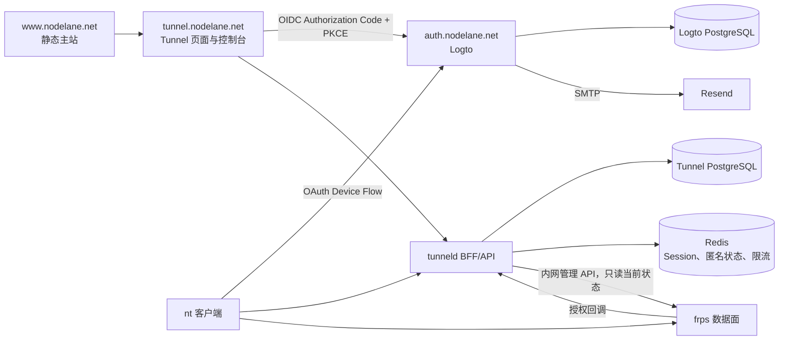

# NodeLane 统一登录与 Tunnel 控制台 MVP 设计

- 日期：2026-09-05
- 状态：修订版已获用户最终确认，作为分阶段实施的约束
- 总体范围：`D:\Project\nodelane\auth`、`D:\Project\nodelane\nodelane-www`、`D:\Project\nodelane\nodelane-tunneld`
- 实施状态：正在编写分阶段实施计划，业务代码尚未开始

### 本次确认记录

- 启动兑换的短期加密重试结果与运行、凭据及启动码消费在同一 PostgreSQL 事务提交；Redis 不再是该结果的唯一存储。
- 匿名 HTTP 域名使用 `anon-` 前缀，永久路由禁止使用该前缀。
- `nt logout` 撤销 Refresh Token 并删除本地凭据；已签发的 Access Token 可以自然过期，不建设即时撤销查询。
- 仅使用原版 frps 的管理 API 和原生统计；不维护 frps 补丁，不部署 Prometheus，不建设历史流量图或服务端流量、请求日志系统。
- 控制台展示账号名下链接、当前运行状态、原生连接数和今日上传/下载字节。原生统计的更新时机和重启清零行为不被包装成精确实时计量。
- HTTP 隧道内的访问并发限制本轮不做；不增加 `limit_conn`、Lua 并发控制库、并发限额字段或相关界面。此决定不取消 5 条永久路由上限、单路由单运行及匿名资源分配限制。

## 1. 目标

为 NodeLane 建立可供未来所有子产品复用的统一身份服务，并在 Tunnel 子产品内交付永久命名路由、网页管理、浏览器授权的 `nt` 登录、无需预安装或预登录的一键启动命令，以及基于原版 frps 的当前状态和字节统计。

设计必须保留匿名模式，尽量复用成熟开源能力，不建设邮件服务器，不把 Tunnel 业务错误地放入全站账户中心，也不为尚未存在的套餐或权益提前建设复杂系统。

## 2. 已确认需求

### 2.1 身份与产品边界

- **AUTH-01**：登录方式为邮箱验证码和 Google；不提供密码登录。
- **AUTH-02**：统一身份服务面向 NodeLane 全站，未来子产品通过 OIDC 接入同一身份源。
- **AUTH-03**：邮箱验证码由 Resend 发送，不自建邮件服务。
- **AUTH-04**：邮箱身份与 Google 身份只允许用户主动绑定，不因邮箱字符串相同自动合并。
- **AUTH-05**：`auth.nodelane.net` 只负责身份、SSO、OIDC、Device Flow、身份绑定和退出，不保存 Tunnel 路由或流量数据。
- **AUTH-06**：MVP 不建设 `account.nodelane.net`。Logto 内置身份设置只承担身份绑定等全局身份操作。
- **AUTH-07**：`www.nodelane.net` 保持静态，不显示实时登录状态；其登录入口指向 Tunnel 控制台，由 Logto SSO 决定是否需要再次验证。

### 2.2 永久路由

- **ROUTE-01**：注册用户可以在 Tunnel 控制台选择 `demo.tunnel.nodelane.net` 形式的永久子域名。
- **ROUTE-02**：MVP 永久路由只支持 HTTP，公开地址使用 `http://`。HTTPS 只显示“正在规划”，不能生成或暗示已可用。
- **ROUTE-03**：每个账户最多拥有 5 条未删除的永久路由。该值是安全上限，不是套餐权益。
- **ROUTE-04**：永久路由定义和已启动运行都没有产品层面的时间上限。
- **ROUTE-05**：同一永久路由同时最多存在一个活动运行，第二次启动必须被拒绝。
- **ROUTE-06**：停止当前运行不删除永久路由，也不释放域名或账户名额。
- **ROUTE-07**：只有删除永久路由才开始释放流程。删除会先停止当前运行。
- **ROUTE-08**：删除后的域名进入 7 天隔离期，原账户可以恢复；隔离期间不计入 5 条上限，但其他账户不能注册。
- **ROUTE-09**：恢复时必须仍有空余名额。7 天期满后域名可被其他账户注册，原路由不可再恢复。
- **ROUTE-10**：用户自有域名、TCP/UDP 永久路由和 TLS 终止均不属于 MVP。

### 2.3 启动码与客户端登录

- **LAUNCH-01**：每次点击复制永久路由的一键命令时生成一个新的启动码。
- **LAUNCH-02**：启动码有效期为 10 分钟，成功兑换后只能使用一次。
- **LAUNCH-03**：启动码只授予“启动指定的一条永久路由”的权限，不代表整台设备登录账户。
- **LAUNCH-04**：启动命令必须可在未安装 `nt`、也未执行 `nt login` 的新机器上完成安装或更新并直接启动。
- **LAUNCH-05**：一次性命令不能读取、创建、覆盖或退出本机已有的 `nt login` 状态。
- **CLI-01**：`nt login` 使用标准 OAuth 2.0 Device Authorization Grant，通过网页完成授权并持久登录当前设备。
- **CLI-02**：已登录的 `nt` 可以列出账户已有路由并启动其中一条，但不能创建、删除或恢复永久路由。
- **CLI-03**：本地 `Ctrl+C` 可以停止当前进程启动的运行；网页可以远程停止活动运行。
- **CLI-04**：命令入口显式区分匿名、账户和一次性授权，不保留旧式 `nt http localhost 3000` 隐含形式。

### 2.4 匿名模式

- **ANON-01**：匿名模式继续支持当前 HTTP、TCP、UDP 临时隧道。
- **ANON-02**：匿名隧道每次运行最长 1 小时。
- **ANON-03**：复制匿名命令不创建服务端数据；`nt` 必须先完成协议适配的本地预检，再申请公网资源。HTTP/TCP 需要建立本地连接；UDP 只能验证地址解析和本地 UDP socket 可建立，不能声称已证明服务正在监听。
- **ANON-04**：匿名账户、Token、预约和运行不写入 PostgreSQL，只保存在 Redis 的短期状态中。
- **ANON-05**：匿名模式没有网页历史和逐隧道长期流量统计，当前运行统计继续由本地 `nt` 展示。
- **ANON-06**：不兼容旧匿名客户端凭据和旧 API。

### 2.5 流量与页面

- **STAT-01**：注册用户可以查看自己名下的永久链接、当前运行状态、每条路由的 frps 原生当前连接数和今日上传、下载字节；账号可汇总在线路由数及可用的原生连接数，两者分开展示。
- **STAT-02**：不建设流量历史存储、历史查询 API、时间序列图表或业务日志系统；不部署 Prometheus。账户、永久路由、删除恢复和当前运行所需的业务状态仍正常保存。
- **STAT-03**：服务端不保存或展示经过隧道的 HTTP URL、Header、Body、响应内容或访客 IP 历史，不从访问日志推导流量。
- **STAT-04**：只读 frps 原生统计用于观察，不承诺精确实时、单次运行累计、跨重启连续或账单级计量；不得以这些快照实现严格流量额度扣减。
- **STAT-05**：`curConns` 展示为 frps 当前代理连接数，不解释为在线隧道数、访客人数或 HTTP 并发请求数；本轮不实现 HTTP 访问并发上限。
- **STAT-06**：沿用原有 frps 服务端单隧道带宽设置；不建设账号总带宽、上传/下载独立限速、累计 GB 配额或套餐系统。
- **UI-01**：主站、登录页、Tunnel 落地页和 Tunnel 控制台共享 NodeLane 视觉语言，但保持产品职责分离。
- **UI-02**：Tunnel 控制台拥有路由列表、创建、详情、启动命令、流量、停止、删除和恢复功能。
- **UI-03**：所有现有 12 种语言、RTL、键盘操作、移动端和 reduced-motion 支持必须保留。

### 2.6 发布边界

- **MIG-01**：本次是破坏性大版本，不进行旧数据导入、新旧表双写、旧 API 保留或数据库升级兼容。
- **MIG-02**：生产环境采用明确停机、备份、删库重建和全量发布。
- **MIG-03**：新数据库从 Goose 第一版迁移初始化，后续版本开始使用增量迁移。
- **MIG-04**：删除生产数据库只能作为单独、人工确认的部署步骤；应用启动不得隐式删库。
- **SCOPE-01**：本轮不做许可证评估。
- **SCOPE-02**：仅使用原版 frps、其管理 API、配置及 HTTP 插件协议，不维护 frps 源码补丁，不新增数据面实现。

## 3. 明确不做

- 不建设自有验证码生成、邮件投递、社交登录或 Device Flow 协议。
- 不建设全站业务门户，不把 Tunnel 路由放进身份中心。
- 不提供网页远程启动；网页只生成命令和停止已有运行。
- 不允许 CLI 创建、删除或恢复永久路由。
- 不提供 HTTPS、用户自有域名、永久 TCP/UDP 路由、套餐、付费、配额购买或权限等级界面。
- 不建设流量历史、趋势图、服务端流量日志、请求明细、日志检索或运行历史页面。
- 不部署 Prometheus，不编写自定义 frps collector 或强制断流补丁。
- 不实施 HTTP 隧道内访问并发限制，不引入 OpenResty `limit_conn` 或 Lua 并发控制依赖。
- 不以原生 `maxPortsPerClient` 或 `maxPoolCount` 冒充 HTTP 访问并发上限。
- 不保证旧版 `nt`、旧匿名凭据、旧数据库或旧 API 可以继续使用。

## 4. 总体架构



### 4.1 域名和所有权

| 域名 | 代码或部署目录 | 职责 |
| --- | --- | --- |
| `www.nodelane.net` | `nodelane-www` | 产品发现、静态登录入口、统一品牌 |
| `auth.nodelane.net` | `auth` | Logto 部署、品牌资源、连接器和 OIDC 配置 |
| `tunnel.nodelane.net` | `nodelane-tunneld` | Tunnel 落地页、控制台、BFF、API、安装器和隧道控制面 |
| `account.nodelane.net` | 不建设 | 未来全局账户门户预留 |

`auth` 目录不复制完整 Logto 源码，只采用固定版本容器和官方配置/主题扩展。官方扩展点无法满足已确认需求时必须先停止沟通，不能自行增加源码补丁。

Logto 和 Tunnel 可以使用同一 PostgreSQL 服务器，但必须使用不同数据库、不同数据库账号和独立迁移生命周期。frps 管理 API/Dashboard 和 Logto Admin Console 只允许从回环地址、VPN 或受信管理网络访问，并分别配置管理认证；浏览器不直接访问 frps 管理接口。

沿用现有 OpenResty HTTP 入口，不新增并发限制模块。frps HTTP 后端端口和管理端口必须由防火墙或等效网络规则阻止公网直连；不能为保护 HTTP 后端而把共用的 `proxyBindAddr` 简单改成回环地址，导致原有公开 TCP/UDP 隧道一并不可达。

### 4.2 会话边界

每个子产品使用自己的 host-only Cookie，不创建覆盖 `.nodelane.net` 的全域 Cookie。统一登录来自 Logto 的 SSO 会话，而不是跨子域共享应用 Cookie。

Tunnel 浏览器 Cookie 只保存不可预测的 Session ID，OIDC Token 使用独立 Session Encryption Key 进行 AEAD 加密后保存在服务端 Redis Session。主站保持静态并始终显示固定的“登录 / Tunnel 控制台”入口。

Tunnel 页面继续由 Astro 静态构建并嵌入现有 Go 服务，不新增 Node SSR 运行时。Go 在提供 `/console` 静态壳和同源 JSON API 之前执行 Session 保护；未登录访问控制台时进入 OIDC 登录，前端不承担 Token 保存或授权判断。

## 5. 身份设计

### 5.1 Logto 配置

创建三个逻辑资源：

1. `nodelane-tunnel-web`：机密 Web 应用，回调位于 Tunnel BFF，使用 Authorization Code、PKCE、`state` 和 `nonce`。
2. `nodelane-nt`：无客户端密钥的 Native 应用，启用 Device Authorization Grant 及其 Refresh Token 续期，不启用密码或自建设备码流程。
3. `https://tunnel.nodelane.net/api`：Tunnel API Resource，至少定义 `routes:read` 与 `runs:start` Scope。

为普通用户配置一个包含上述两个 Scope 的默认 User Role，否则只创建 Resource/Scope 不会授予新用户 API 权限。它是 Logto 的内部授权配置，不是套餐或对用户展示的权限等级。

Device Authorization 请求显式携带该 Resource 和 `openid offline_access routes:read runs:start`。API 只接受目标 Resource 的有效 Access Token，不把 ID Token、默认不透明 Token 或其他应用的 Token 当作 Tunnel API 凭据。

登录体验只启用邮箱验证码和 Google。邮箱通过 Logto SMTP Connector 连接 Resend：

- Host：`smtp.resend.com`
- Port：`465`
- TLS：隐式 TLS
- Username：`resend`
- Password：轮换后的 Resend API Key
- Sender：`NodeLane <auth@nodelane.net>`

发件人显示名和本地部分属于部署配置，可以在不改业务代码的情况下调整；发件域固定为已验证的 `nodelane.net`。

SMTP Connector 使用官方配置结构，包含 `secure=true`、`auth.user`、`auth.pass`、`fromEmail` 及其校验要求的邮件模板；模板齐全不代表启用密码登录或密码找回入口。Account Center 需要显式启用并允许社交身份编辑，控制台提供身份设置入口，但不复制身份绑定协议或 Logto 业务页面。

### 5.2 本地账户投影

Tunnel 在首次成功登录时创建本地 `tunnel_accounts` 投影。唯一身份键为 OIDC `issuer + subject`，邮箱只用于展示，不参与归属判断或去重。

Google 与邮箱身份的绑定由用户在 Logto 身份设置中主动完成。即使两个身份返回相同邮箱，Tunnel 也不能自行合并本地账户。

验收区分“将尚未绑定的 Google 身份绑定到已有邮箱账号”与“合并两个已经独立存在的账号”。前者使用 Logto 原生 Account Center；后者不属于本轮范围，发生身份冲突时显示提供方错误，不能自行迁移路由归属。

### 5.3 `nt login`

`nt login` 直接使用 Logto 的 Device Authorization Endpoint，不通过 Tunnel 自建中间设备码。客户端显示用户码、验证地址和过期时间，并在可用时打开浏览器；无 GUI 环境仍可复制地址到其他设备完成授权。

Refresh Token 优先存入系统凭据库。Windows 使用 Credential Manager；Linux 使用 Secret Service。无图形会话或无 Secret Service 时，允许回退到用户配置目录中的 `0600` 文件，并明确提示安全级别降低。`nt logout` 调用撤销端点并删除本地凭据。

退出成功意味着本地账户凭据已移除且 Refresh Token 撤销成功；已签发的 Access Token 按原有效期自然失效。撤销端点不可用时仍清除本地凭据，但返回明确的撤销未确认错误，不宣称远端撤销成功。不增加 Access Token 黑名单、逐请求 introspection 或设备退出联动停止所有运行的行为。

## 6. 持久数据模型

新数据库不沿用现有 `clients`、`client_tokens`、`tunnels` 表。第一版 Goose 迁移直接创建下列新模型。

### 6.1 `tunnel_accounts`

- `id UUID PRIMARY KEY`
- `identity_issuer TEXT NOT NULL`
- `identity_subject TEXT NOT NULL`
- `created_at TIMESTAMPTZ NOT NULL`
- `last_seen_at TIMESTAMPTZ NOT NULL`
- 唯一约束：`(identity_issuer, identity_subject)`

### 6.2 `tunnel_routes`

- `id TEXT PRIMARY KEY`，使用不可枚举的 `rte_` 前缀 ID
- `account_id UUID NOT NULL`
- `protocol TEXT NOT NULL`，MVP 只允许 `http`
- `subdomain TEXT NOT NULL`，只保存标签 `demo`
- `proxy_name TEXT NOT NULL UNIQUE`，固定使用该路由的 `rte_` 前缀 ID，稳定且不包含域名或账户信息
- `status TEXT NOT NULL`，数据库值为 `active` 或 `deleted`
- `created_at`、`updated_at`、`deleted_at`
- `recoverable_until TIMESTAMPTZ NULL`
- `name_released_at TIMESTAMPTZ NULL`

逻辑状态按字段派生：

- `ACTIVE`：`status=active`
- `DELETED_RECOVERABLE`：已删除、当前时间不晚于 `recoverable_until`、名称尚未释放
- `RELEASED`：名称已释放，路由保持删除且不可恢复

对子域名建立大小写无关的部分唯一约束，只约束 `name_released_at IS NULL` 的记录。这样隔离期阻止抢注，期满释放后又不需要删除历史路由行。

### 6.3 `route_launch_codes`

- `id TEXT PRIMARY KEY`，使用 `nlc_` 前缀
- `route_id TEXT NOT NULL`
- `secret_hash TEXT NOT NULL`
- `created_at`、`expires_at`、`redeemed_at`、`revoked_at`

幂等 nonce 仅以摘要保存在 `operation_replays`，不在启动码行重复保存另一份 nonce 真相源。

数据库只保存 HMAC-SHA-256 哈希。每次复制生成新码；不同启动码可以同时处于未使用状态。路由删除时撤销所有未使用码。

### 6.4 `tunnel_runs`

- `id TEXT PRIMARY KEY`，使用 `run_` 前缀
- `route_id TEXT NOT NULL`
- `started_via TEXT NOT NULL`：`device_login` 或 `launch_code`
- `status TEXT NOT NULL`：`starting`、`online`、`stopping`、`offline`
- `desired_state TEXT NOT NULL`：`running` 或 `stopped`
- `request_ip INET NOT NULL`
- `connected_ip INET NULL`
- `created_at`、`connected_at`、`last_heartbeat_at`、`stop_requested_at`、`stopped_at`
- `connect_deadline_at TIMESTAMPTZ NOT NULL`，注册运行首次连接期限为创建后 2 分钟
- `lease_expires_at TIMESTAMPTZ NULL`，连接成功后由服务端心跳更新，最长为最近一次有效心跳后 90 秒
- `stop_reason TEXT NULL`

部分唯一索引保证同一路由在 `starting`、`online`、`stopping` 中最多有一行。创建运行、占用唯一活动槽和消费启动码必须处于同一数据库事务。

该表是运行生命周期状态，不提供历史查询或历史页面。已离线的运行及其凭据在停止幂等所需的 2 分钟保留窗口、以及所有相关启动响应的重放窗口都结束后由后台清理；永久路由与 7 天域名恢复记录不随之删除。

### 6.5 `run_credentials`

- `id TEXT PRIMARY KEY`
- `run_id TEXT NOT NULL UNIQUE`
- `secret_hash TEXT NOT NULL`
- `created_at TIMESTAMPTZ NOT NULL`
- `revoked_at TIMESTAMPTZ NULL`

运行凭据为随机不透明 Bearer Token，只能控制一个 `run_id`，不提供路由列表或账户权限。明文只返回给当前 `nt` 进程并保存在内存中；停止后撤销。

该表只保存注册路由的运行凭据。匿名运行凭据的 ID、哈希和有效期只保存在 Redis。

允许建立连接或续租的凭据必须同时满足：秘密哈希匹配、`run_id` 匹配、未撤销、所属路由仍为 `active`、运行期望为 `running` 且处于可连接状态。尚未首次连接时校验 `now < connect_deadline_at`；曾经连接的运行及重连校验 `now < lease_expires_at`。API 心跳、启动结果重放及每次 frps 授权都读取这些当前条件，不能只检查凭据哈希或等待后台撤销。

停止及终态响应单独处理：在短期保留窗口内，匹配本运行秘密的重复停止可以幂等返回，心跳可返回 `run_stopped` 以便客户端结束；这些响应不能续租、重新连接、解密启动凭据或取得账号权限。

### 6.6 `operation_replays`

- `id TEXT PRIMARY KEY`
- `operation TEXT NOT NULL`，区分创建路由、账号启动与启动码兑换
- `principal_key TEXT NOT NULL`，由服务端确定的账号或启动码 ID，不使用客户端自报账号
- `key_hash TEXT NOT NULL`，客户端 Idempotency Key 或 nonce 的摘要
- `request_hash TEXT NOT NULL`，规范化请求的摘要，用于拒绝同 key 不同请求
- `route_id TEXT NULL`、`run_id TEXT NULL`
- `response_ciphertext BYTEA NOT NULL`，使用独立 Idempotency Encryption Key 的 AEAD 密文
- `created_at`、`expires_at`，有效期为成功提交后 2 分钟
- 唯一约束：`(operation, principal_key, key_hash)`

该表只保存短期协议重放状态，不保存业务日志或历史统计。行与业务结果在同一 PostgreSQL 事务提交；到期后即不可读取，由后台及请求内惰性清理删除。运行凭据表和启动码表仍只保存秘密哈希，重放密文使用独立密钥和包含操作、主体及 key 的关联数据。

所有重放读取前必须按第 9.4 节权限矩阵重新验证该操作允许的当前认证介质及权限，并由服务端解析账号、限定路由归属；浏览器 Session 与账号 Access Token 不能因重放而互换使用。启动码兑换重新验证完整启动码秘密。Idempotency Key 或 nonce 本身不是凭据。

请求摘要绑定操作的明确字段：创建路由绑定协议与规范化子域名；账号启动绑定服务端解析后的路由 ID 及所有影响该运行的申请参数；启动码兑换绑定启动码 ID、路由 ID 和所有影响运行的参数。认证 Token 和启动码秘密不作为业务字段保存。AEAD 关联数据绑定 `operation`、`principal_key`、`key_hash`、`request_hash`、关联路由/运行 ID 及 `expires_at`，不能将其他行的密文交换使用。

认证完成后，按第 7.3 节统一锁顺序读取路由、运行、凭据和重放记录，在同一事务内检查请求摘要及当前可用性，再返回已提交结果。停止或删除与重放按锁取得先后排序：如果停止/删除先完成，不能返回可用凭据；如果重放先完成，后续停止仍正常撤销该运行。账号创建路由的重放只返回原资源结果，不重新创建已删除资源。

本轮不创建 `tunnel_audit_events`、HTTP 请求日志表或流量历史表。运行错误诊断只保留必要的脱敏错误码和请求 ID，不建设可查询的操作日志产品。

### 6.7 `network_bans`

保留面向运营安全的持久 CIDR 封禁能力，字段包括网络、作用域、原因、创建时间和可选过期时间。它不是匿名会话或匿名身份记录，不随 Redis 临时状态清理。

### 6.8 配额策略边界

MVP 使用一个小型 `RoutePolicyProvider` 边界返回 `max_routes=5` 和允许协议集合 `{http}`。默认实现读取服务端配置，不建立套餐、权益或订阅表。未来可以替换策略提供者而不修改路由事务和 API 形状。

不添加 HTTP 访问连接上限策略。当前已有的 `FRP_BANDWIDTH_LIMIT` 继续通过 `NewProxy` 插件设置 `bandwidthLimit` 及 `bandwidthLimitMode=server`；这是 frps 原生的单代理读写共享带宽限制，不是上传/下载各自独立或账号汇总的带宽额度。

## 7. 生命周期与并发

### 7.1 永久路由

```text
ACTIVE --删除--> DELETED_RECOVERABLE --7天--> RELEASED
  ^                    |
  +------恢复----------+
```

- 删除活动路由时，事务先标记路由删除并设置 `recoverable_until`，同时把当前运行设为期望停止并撤销未使用启动码。
- 删除后立即释放账户 5 条上限中的一个名额，但域名仍保持唯一占用。
- 恢复操作锁定账户与路由，确认仍在 7 天内且账户未达到 5 条，再恢复为 `active`。
- 名称释放采用事务内的惰性检查加后台清理，两者必须使用同一唯一约束防止并发抢注。

### 7.2 运行

```text
STARTING --frps确认--> ONLINE --停止请求--> STOPPING --确认断开--> OFFLINE
    |                       |                                  ^
    +------启动失败---------+------客户端退出/租约超时---------+
```

注册运行没有产品时长上限。PostgreSQL 中的运行状态、首次连接期限和 `lease_expires_at` 是注册运行的权威；Redis 只承载匿名运行的租约，不为同一注册运行另设可独立续期的权威状态。

- `starting` 必须在创建后 2 分钟内完成代理注册，心跳不能延长首次连接期限。frps 的 `NewProxy` 回调只是授权请求，不能仅凭回调获准就标为 `online`；需要确认原版管理 API 中对应代理已经在线，并与该次授权建立的运行关联一致。
- `nt` 每约 5 秒并带抖动发送 API 心跳，同时读取 `desired_state`。有效心跳以条件更新续期到服务端当前时间后 90 秒；超过期限的凭据不得重新续期。短暂断网期间保留原运行槽，90 秒内允许原运行重新连接，不创建第二个逻辑运行。
- 停止或租约到期先禁止续租及新的代理授权，将运行设为 `stopping`。回收任务按运行 ID 条件更新，迟到的关闭通知不能影响同一路由的新运行。
- 正常官方客户端关闭本地 frpc 后，结合关闭通知和未经展示缓存的原生管理 API，确认对应代理 `phase=offline` 且可用样本中的 `curConns=0`，再转为 `offline`、撤销运行凭据并释放活动槽。该 API 不暴露空闲工作连接池，不能声称它证明了所有底层 socket 都已关闭；公网不可达与长连接结束还需要黑盒验收。无代理样本需结合本次是否实际注册及可信断开证据判断，不能把单次 404 当成已停止。管理 API 不可用或状态不能确认时保留 `stopping`。

网页停止使用原版 HTTP 插件和官方 `nt` 协作：`nt` 收到停止状态后关闭整个嵌入式 frpc 服务；frps 拒绝已停止运行后续的 Ping、NewWorkConn 和代理授权。显式配置 frpc `transport.heartbeatInterval=5` 以及客户端、服务端的有限 heartbeat timeout，不能因 `tcpMux=true` 的上游默认值导致应用 Ping 被关闭。正常网络及官方 `nt` 条件下，从点击停止到公网不可访问且 `nt` 退出的目标不超过 15 秒，需以长连接黑盒测试验证。

本轮没有原版 frps 之外的主动强制断流接口。90 秒是授权续租和重连期限，不宣称在客户端卡死、恶意自制客户端或控制面分区时能强制终止所有已建立数据流。此时展示停止超时并失败关闭新授权，不通过重启整个 frps、调用清理统计 API 或写源码补丁冒充单运行停止。后台协调任务在依赖恢复后继续确认和回收。

### 7.3 启动码

```text
ISSUED --成功兑换--> REDEEMED
   |--10分钟-------> EXPIRED
   +--路由删除-----> REVOKED
```

首次兑换先验证启动码秘密，再按统一的“账户、路由、启动码（如有）、运行、运行凭据、重放记录”顺序取得需要的数据库锁；创建、删除、恢复、账号启动和兑换操作不得使用相反的锁顺序。若路由已有活动运行，返回 `run_already_active` 且不消费启动码。

客户端为兑换请求生成 nonce。成功响应使用独立 Idempotency Encryption Key 进行 AEAD 加密，写入 `operation_replays`；消费启动码、创建运行、创建运行凭据和保存加密响应必须在同一 PostgreSQL 事务原子提交，提交成功后才返回响应。Redis 只可作为可丢弃的加密结果缓存；缓存未写入、被清空或服务在提交后崩溃，都不得使已提交结果无法在窗口内恢复。

重试仍须验证完整启动码的秘密、nonce 和请求摘要。首次成功提交后 2 分钟内，相同启动码与 nonce 的重试恢复同一运行和凭据，不再次消费或生成凭据；不同 nonce 收到 `launch_code_used`，同 key 不同请求收到 `idempotency_conflict`。重放不能复活已停止运行或已删除路由，也不能返回已撤销的凭据。首次兑换必须在启动码 10 分钟有效期内；已提交结果的重放期限单独按上述 2 分钟计算。

重放响应携带原运行的绝对连接/租约截止时间，不能因重试重新生成一段有效期。重放到期后即使清理尚未运行，也不再解密或返回旧凭据。客户端需要等待未连接运行回收或停止当前运行，再回到网页生成新启动码。账号登录后的启动接口采用同样的短期事务幂等规则，并在每次重试重新验证 `runs:start` 和路由归属，不因缺少启动码而留下凭据响应丢失窗口。

## 8. 匿名模式

匿名命令在浏览器中根据协议、本地地址、端口和操作系统生成，复制本身不访问创建 API。

`nt anonymous` 的顺序固定为：

1. 解析并验证参数。
2. 执行本地预检：HTTP/TCP 建立连接；UDP 验证地址解析并建立本地 UDP socket。
3. 生成或读取本地安装实例 ID。
4. 带 Idempotency Key 请求匿名预约。
5. 获得随机公网资源和运行凭据。
6. 启动嵌入式 frpc，并续租心跳。

Redis 状态和默认限制：

- 待连接预约 TTL：2 分钟
- 心跳租约 TTL：90 秒，正常心跳续租
- 单次运行硬上限：1 小时，不允许续期越过该上限
- 每安装实例同时最多 1 条
- 每 IPv4 地址或 IPv6 `/64` 同时最多 2 条
- 每安装实例每 10 分钟最多成功分配 5 次
- 每网络键每 10 分钟最多成功分配 20 次

匿名预约、资源占用、成功分配限流和短期幂等响应通过 Redis 原子操作一起保存。匿名幂等索引按安装实例、服务端规范化网络键和客户端 Idempotency Key 摘要划分，协议及资源申请参数单独进入请求摘要；重试仍执行来源及封禁检查，同索引不同请求摘要拒绝。匿名重试结果使用与 OIDC Session 不同用途的 AEAD 密钥加密，TTL 为 2 分钟且不得晚于该授权期限；Redis 中的运行秘密本身仍只保存哈希。重复请求不重复占用资源或扣成功分配次数；已终止或到期的授权不重放凭据，响应中的原始期限不延长。释放资源必须比较所属运行 ID，旧运行的迟到释放不能删除新运行的占用。

授权租约与资源占用分开：90 秒到期使凭据不可用并触发核实，不等于 TCP/UDP 公网端口已经释放。资源所属运行及待回收索引保留到数据面核实结束，不能仅依赖 Redis 键过期或易丢失的过期通知放行复用。协调任务定期检查到期项；Redis 状态丢失后，在与原生 frps 状态核对完成前不开放可能冲突的资源分配。

限流响应携带 `Retry-After`，CLI 显示剩余等待时间和可执行操作。正常官方客户端退出后释放；崩溃、断网或未连接预约由到期清理回收，数据面尚未确认退出的资源不能被宣称已安全释放。安装实例 ID 可被用户删除，因此网络限制是必要的第二道约束；这些限制用于控制资源与状态膨胀，不作为强身份防滥用承诺。

1 小时到期后控制面拒绝续租和新的 frps 授权，官方 `nt` 同时按该截止时间结束；原版 frps 对非合作客户端既有数据流的限制与第 7.2 节一致，不承诺补丁级强制断流。

匿名代理名使用 `anon_` 前缀，永久代理名固定等于其 `rte_` 路由 ID；两类名称均由服务端生成，并由 `NewProxy` 授权校验精确值。匿名 HTTP 公开域名使用 `anon-<随机标签>.tunnel.nodelane.net`，随机标签至少含 128 位随机性。永久路由验证器拒绝整个 `anon-` 前缀，从代理名和公开域名两层隔离 Redis 匿名分配与 PostgreSQL 永久路由，不用跨存储检查后写入防碰撞。NodeLane 不抓取、落库或展示匿名逐代理历史统计。

## 9. API 与授权

### 9.1 浏览器认证端点

- `GET /auth/login`
- `GET /auth/callback`
- `POST /auth/logout`
- `GET /api/v1/session`

浏览器写请求同时校验 host-only Session、CSRF Token、`Origin` 和 Content-Type。OIDC 回调验证 `state`、`nonce`、issuer、audience、签名和时间声明。

浏览器退出清除本产品 Redis Session 与 Cookie，撤销对应 Refresh Token，并使用标准 OIDC end-session 结束当前浏览器的 Logto 会话；不建设跨产品会话撤销广播，不承诺其他产品已有 Session 或已签发 Access Token 立即失效。

### 9.2 Tunnel 资源端点

- `GET /api/v1/routes`
- `POST /api/v1/routes`
- `GET /api/v1/routes/{id}`
- `DELETE /api/v1/routes/{id}`
- `POST /api/v1/routes/{id}/restore`
- `POST /api/v1/routes/{id}/launch-codes`
- `POST /api/v1/routes/{id}/runs`
- `POST /api/v1/routes/{id}/runs/current/stop`
- `GET /api/v1/routes/{id}/stats`

`/stats` 只返回第 12 节定义的当前快照，不接受历史时间范围。路由列表保持资源元数据和当前运行关联，前端按拥有的路由 ID 读取统计，不代理任意 frps 管理 URL。

### 9.3 非 Session 端点

- `POST /api/v1/launch/redeem`
- `POST /api/v1/anonymous/runs`
- `POST /api/v1/runs/{id}/heartbeat`
- `POST /api/v1/runs/{id}/stop`

### 9.4 权限矩阵

| 操作 | 网页 Session | 已登录 `nt` | 启动码 | 运行凭据 | 匿名 |
| --- | ---: | ---: | ---: | ---: | ---: |
| 查看永久路由 | 是 | 是 | 否 | 否 | 否 |
| 读取当前路由统计 | 是 | 是，需 `routes:read` | 否 | 否 | 否 |
| 创建、删除、恢复 | 是 | 否 | 否 | 否 | 否 |
| 生成启动码 | 是 | 否 | 否 | 否 | 否 |
| 启动账号路由 | 否 | 是 | 仅绑定路由 | 否 | 否 |
| 网页远程停止 | 是 | 否 | 否 | 否 | 否 |
| 停止自身运行 | 否 | 否 | 否 | 是 | 是 |
| 创建匿名运行 | 否 | 否 | 否 | 否 | 是 |

所有按账户访问的资源都先按当前 `account_id` 限定查询。跨账户访问与不存在统一返回 `404 route_not_found`，不泄露资源存在性。

### 9.5 错误契约

所有 API 错误使用统一 JSON envelope：`{"error":{"code":"...","message":"...","request_id":"..."}}`。`message` 可以本地化，客户端逻辑只能依赖稳定的 `code`。

至少固定以下错误码：

- `invalid_request`（400）
- `unauthorized`（401）
- `insufficient_scope`（403）
- `route_not_found`（404）
- `subdomain_invalid`（400）
- `subdomain_reserved`（409）
- `subdomain_conflict`（409）
- `route_limit_reached`（409）
- `route_deleted`（409）
- `run_already_active`（409）
- `run_stopped`（410）
- `idempotency_conflict`（409）
- `launch_code_expired`（410）
- `launch_code_used`（410）
- `launch_code_revoked`（410）
- `rate_limited`（429，必须带 `Retry-After`）
- `dependency_unavailable`（503）

创建路由、启动运行、兑换启动码和匿名分配必须接收 Idempotency Key 或客户端 nonce，并以数据库唯一约束或 Redis 原子操作作为最终保证；不能只依赖进程内互斥锁。

## 10. `nt` 命令与凭据

MVP 公共命令模型：

```text
nt
nt anonymous http localhost 3000
nt login
nt logout
nt routes
nt start demo localhost 3000
nt launch <一次性启动码> localhost 3000
```

- 裸运行 `nt` 显示“匿名使用 / 登录账号”选择。
- `nt start` 只接受已登录设备，路由参数可以是唯一子域名标签或路由 ID。
- `nt launch` 只使用启动码，不读取或改变设备登录凭据。
- 账号 Access Token 只发送到 `tunneld` API，绝不放入 frp metadata。
- frp metadata 的业务授权只使用运行级凭据，不能携带账户 Token。运行凭据不能换取账户 Token，也不能启动第二条路由；原生 frp 握手认证不能代替 HTTP 插件中的逐运行授权。
- `Ctrl+C` 使用运行凭据调用停止接口，随后关闭本地 frpc；即使停止回报失败，本地进程也必须结束，服务端由心跳超时回收。

Linux、PowerShell 和 CMD 启动器都必须接收并安全传递剩余参数。网页展示的精确命令字符串是验收对象，不能用另一个 shell 的等价命令替代。

命令生成器按具体 shell 对地址、端口和启动码逐参数编码，不拼接未经转义的用户输入。CLI 必须先分派 `anonymous`、`start`、`launch` 等命令，再选择对应凭据依赖；不能在全局启动路径预先打开账户凭据库。HTTP/TCP 本地连接与 UDP 地址/socket 预检均在申请运行或兑换启动码之前完成。

## 11. Tunnel 页面与交互

### 11.1 页面地图

| 页面 | 职责 |
| --- | --- |
| `/` | Tunnel 介绍、匿名快速开始、登录管理入口 |
| `/console/tunnels` | 账号链接列表、路由数量、运行状态、原生当前连接数和今日上传/下载字节 |
| `/console/tunnels/new` | 子域名选择和 HTTP 路由创建 |
| `/console/tunnels/{id}` | 命令、运行状态、当前数字统计、停止和删除 |
| `/console/tunnels?view=deleted` | 7 天内的删除项、倒计时和恢复 |

MVP 不设置只有一个业务模块的侧边栏；继续使用 NodeLane 顶部导航，并在控制台内使用“永久隧道 / 最近删除”紧凑导航。

控制台是静态壳加同源 API，不为运行时生成的路由 ID 预渲染页面。Go 路由在输出壳内容前完成 Session 检查，对嵌套详情路径提供受保护的壳回退，并返回 `Cache-Control: no-store`。语言切换保留控制台当前页面和路由 ID，不复用会跳回首页的旧首页语言 URL 生成逻辑。

### 11.2 子域名输入

- 输入只接收标签，固定展示 `.tunnel.nodelane.net` 后缀。
- 长度为 3–32 个字符。
- 只允许小写 ASCII 字母、数字和连字符。
- 必须以字母或数字开头、结尾。
- 不接受 Unicode、Punycode、点号或完整域名。
- 至少保留：`www`、`auth`、`api`、`admin`、`console`、`status`、`support`、`mail`、`smtp`、`frp`、`tunnel`。
- 拒绝整个 `anon-` 前缀，该前缀仅供匿名 HTTP 公网域名使用。
- 即时可用性检查只提供提示，最终结果由创建事务和唯一约束决定。

达到 5 条时禁用创建按钮并解释为“当前安全上限”，不出现免费、付费、套餐、升级或权益承诺。

### 11.3 详情页

详情页按顺序显示：

1. 永久域名和路由状态。
2. 当前运行状态。
3. 本地地址、端口与 Linux/PowerShell/CMD 命令。
4. 原生当前连接数、今日上传字节和今日下载字节，不显示历史图表或时间范围切换。
5. 停止操作。
6. 与停止视觉分离的删除危险区。

点击复制时才请求启动码。成功后显示 10 分钟倒计时和单次使用提示；剪贴板失败时显示可手动选择的命令。已有活动运行时禁止生成新启动命令，并提示先停止当前运行。

删除确认框显示完整域名，并明确说明会停止当前运行、进入 7 天保留期并立即释放账户名额。恢复入口位于最近删除标签中。

### 11.4 状态和视觉

路由和运行界面至少覆盖：从未运行、正在连接、在线、正在停止、离线、已删除可恢复、已释放、启动码生成中、已复制、已过期、已使用、统计加载、暂无数据、统计不可用、登录失效、域名冲突和停止超时。

主站与 Tunnel 落地页采用 Persuade 模式，控制台采用 Operate 模式。复用现有深蓝黑背景、NodeLane 标识、字体、间距和稀缺薄荷绿色信号。登录页使用同一品牌资源，但不把 Logto 界面伪装成 Tunnel 业务页。

## 12. 原生当前统计

### 12.1 来源与授权

固定使用原版 frps `v0.70.0` 管理 API。启用仅监听回环或受信管理网络的 Web Server 和独立 Basic Auth，设置 `enablePrometheus=false`；原生内存统计随 Web Server 启用，不依赖 Prometheus。

`tunneld` 先按当前账号查询自己的 `tunnel_routes`，得到允许的 `proxy_name`，再查询并映射对应的 `GET /api/v2/proxies/{name}`。需要列表时使用 `/api/v2/proxies` 的原生分页及状态过滤，但最后必须再次与账号允许的名称集合精确匹配。`user`、`clientID` 和前端自报的代理名不能代替 NodeLane 账号归属校验。

适配层只输出下列白名单字段，不把包含代理配置、metadata 或其他用户信息的完整 frps 响应传给浏览器。frps 管理地址来自固定服务端配置，拒绝客户端传入地址、重定向目的地或任意管理 API 路径。

### 12.2 数字与口径

| NodeLane 字段 | 来源 | 含义 |
| --- | --- | --- |
| `current_connections` | `status.curConns` | frps 当前代理工作连接数；HTTP 连接复用下不是访客人数或并发请求数 |
| `upload_bytes_today` | `status.todayTrafficOut` | 以本地服务为主体，发送到公网访问者的今日字节 |
| `download_bytes_today` | `status.todayTrafficIn` | 以本地服务为主体，从公网访问者接收的今日字节 |
| `proxy_state` | `status.phase` | frps 观测到的代理状态，不代替数据库里的期望运行状态 |
| `observed_at` | 服务端采样时间 | 该快照的时间，不是流量发生时间 |
| `availability` | 适配层 | `available`、`not_observed` 或 `unavailable` |

部署统一 frps 与 `tunneld` 的统计时区为 UTC，并让页面清楚标识今日统计的时区。今日计数按 frps 的日桶切换，不等于单次运行累计；相同代理名重连可继续当日累计，frps 重启则清零。NodeLane 不补算跨午夜或跨重启累计值。

HTTP/TCP 字节由原生实现通常在工作连接关闭时累计；长连接存续期间可能滞后，UDP 按原生包处理路径更新。必须用已知请求体、响应体和连接关闭行为验证方向及更新时间，不仅根据字段名字判断。

账号在线路由数与当前连接数分开统计；后者仅汇总当前可用快照，缺失项标为不完整，不补零。原生 `/api/v2/users` 的 `proxyCount` 可能包含离线记录，不能直接当作账号实时并发数。此次明确不设置 HTTP 访问并发上限，也不把这套统计当作限流器。

### 12.3 刷新与降级

页面可每 5 秒刷新一次，隐藏页面暂停刷新。适配层按固定节点及代理名短暂合并请求或缓存当前快照，TTL 不超过 5 秒；不形成快照序列，不写入 PostgreSQL 或流量存储。午夜切换时不复用前一天的快照。

管理 API 超时、无效响应或认证失败时，统计区域显示不可用，不改变业务路由状态。未观测到代理时返回 `not_observed`；不可用或尚无样本时数字为 `null`，不能假装为零。停止操作本身不等待统计展示刷新，生命周期核实仍按第 7.2 节处理。

### 12.4 无历史与复用边界

不调用 `/api/v2/proxies/{name}/traffic` 历史接口，不建设历史流量数据库、流量日志采集器、趋势图或自定义 collector。原版 frps 自身的原生内存日桶和离线条目由其上游逻辑维护；NodeLane 不展示、持久化或承诺恢复这些内部历史。

将原生 API 访问封装在窄的 `RuntimeStatsProvider` 适配边界中。未来如增加账号配额或更精确的计量，应另行确认计数权威、存储和执行方案，不能在此接口中悄悄加入限额扣减或 frps 补丁。

## 13. 安全设计

- 启动码和运行凭据使用至少 256 位随机秘密，并以带独立 Pepper 的 HMAC-SHA-256 哈希保存。
- 浏览器 Session ID、CSRF Token、OAuth `state`、PKCE verifier 和 nonce 使用密码学安全随机源。
- Cookie 必须是 `Secure`、`HttpOnly`、host-only，并设置适合 OIDC 回调的 `SameSite=Lax`。生产 Session Cookie 使用 `__Host-` 前缀、`Path=/` 且不设置 Domain，避免下级隧道域名植入同名域 Cookie。
- Access Token 必须验证签名、issuer、audience、有效期和允许的 Scope；JWKS 缓存必须支持正常密钥轮换。
- 除用户明确请求并在当前页面生成的 10 分钟一次性启动码外，任何前端 HTML、命令、URL、日志、指标和错误响应都不得包含 Resend Key、Google Secret、OIDC Client Secret、Refresh Token、Session 内容、启动码哈希 Pepper、运行凭据或 frps 共享密钥。启动码可以出现在用户复制的命令参数中，但不得进入服务端访问日志或前端遥测。
- OIDC Session、PostgreSQL 启动幂等结果及 Redis 匿名幂等结果使用分离用途的 AEAD 密钥与关联数据；匿名和注册运行秘密本身只保存哈希，不在数据库或 Redis 保存可直接读取的明文。哈希 Pepper 与 AEAD 加密密钥不能混用。
- 启动码签发、兑换、匿名分配、登录回调和子域名检查均配置独立限流。
- API 返回 `X-Request-ID`，错误 envelope 包含相同 ID。不建设访问或流量日志；必要的运行错误诊断只包含结果、稳定错误码和脱敏标识，不记录完整命令、请求内容或访客 IP 历史。
- 真实来源 IP 只信任配置中的反向代理网段。Cloudflare 链路使用 `CF-Connecting-IP` 恢复入口地址，并显式向上游发送 `X-Real-IP`；上线验收读取实际 `nginx -T` 并发起真实请求。
- 先前在沟通中暴露的 Resend Key 必须撤销后重新生成。历史上暴露过的 frps 凭据也必须轮换并同步 `FRP_AUTH_TOKEN`，不能复用旧值。

## 14. 故障降级

| 故障 | 必须表现 |
| --- | --- |
| Resend 不可用 | 邮箱登录显示可重试错误；Google 登录和匿名模式不受影响 |
| Google 不可用 | Google 登录显示提供方错误；邮箱登录和匿名模式不受影响 |
| Logto 不可用 | 新登录、Token 刷新和 `nt login` 失败；匿名模式仍可用 |
| frps 管理 API 不可用 | 当前统计显示不可用；创建与发起停止不依赖统计快照，停止的最终断开确认可保持等待，不伪造离线 |
| Tunnel PostgreSQL 不可用 | 所有账户路由操作失败关闭，不回退为匿名权限 |
| Redis 不可用 | Web Session、匿名分配和限流拒绝新操作；返回稳定服务不可用错误，不从缓存缺失推断新的授权 |
| frps 不可用 | 启动明确失败并受首次连接期限约束；控制面仍可查看、请求停止和删除路由；活动槽按第 7.2 节确认后释放 |
| `nt` 异常退出 | 90 秒期限后拒绝原凭据续租或重连；原生数据面断开状态确认后转为离线，不承诺故障客户端既有连接的强制终止 |

## 15. 开源复用基线

本节只固定来源、版本、职责和升级边界，不进行许可证分析。

| 组件 | 固定版本与提交 | 使用方式 | NodeLane 维护边界 |
| --- | --- | --- | --- |
| Logto | `v1.43.0` / `d066df7d26d596b6ba7ad0bdfaaecfda9c612226` | 固定容器、自托管 OIDC、邮箱、Google、Device Flow | 配置、品牌、连接器；默认不 Fork |
| Goose | `v3.28.0` / `43d2d9c819ed6c9ba2b67a86bdf9fc08562495b7` | 嵌入 Go 服务执行版本化 SQL 迁移 | Tunnel 自有 migration 文件 |
| frp | `v0.70.0` / `7b6e01f04f286632f0d23715aa17a3bc41234b5c` | 原版唯一数据面、原生管理 API 与服务端带宽限制 | HTTP 插件、配置和管理 API 薄适配；不维护源码补丁 |
| go-oidc | `v3.21.0` / `c914bd380327a5a3a81403774d1a5d5b73772ce7` | BFF OIDC Discovery、ID Token/JWKS 校验 | 薄适配层 |
| `golang.org/x/oauth2` | `v0.36.0` / `4d954e69a88d9e1ccb8439f8d5b6cbef230c4ef9` | Web OAuth 与 `nt` Device Flow | 薄适配层 |
| go-keyring | `v0.2.8` / `2fb288e584191da8306e42b9f86a697742fca71e` | Windows Credential Manager、Linux Secret Service | 凭据存储抽象与受控文件回退 |
| Resend | 托管服务 | Logto SMTP Connector | 域名、Key、发件人和投递监控 |

每次升级单独提交，先在集成环境验证 OIDC 回调、Device Flow、frps 插件、管理 API 字段与统计口径、数据库迁移，再允许进入生产。上游官方扩展点不能满足需求时必须先沟通，不自行改为维护补丁。

本次原生能力核验的主要来源：

- [frp V2 管理 API 模型](https://github.com/fatedier/frp/blob/7b6e01f04f286632f0d23715aa17a3bc41234b5c/server/http/model/v2.go)：`curConns`、`todayTrafficIn`、`todayTrafficOut` 及状态字段。
- [frp V2 管理 API 控制器](https://github.com/fatedier/frp/blob/7b6e01f04f286632f0d23715aa17a3bc41234b5c/server/http/controller_v2.go)：代理过滤、分页与用户汇总行为。
- [frp HTTP 工作连接统计](https://github.com/fatedier/frp/blob/7b6e01f04f286632f0d23715aa17a3bc41234b5c/server/proxy/http.go)：连接关闭时更新字节及当前连接数的具体位置。
- [frp 服务端内存统计](https://github.com/fatedier/frp/blob/7b6e01f04f286632f0d23715aa17a3bc41234b5c/pkg/metrics/mem/server.go)：日桶、同名代理复用、内存状态清理。
- [Logto Device Flow 指南](https://docs.logto.io/quick-starts/device-flow)、[Account Center](https://docs.logto.io/end-user-flows/account-settings/by-account-center-ui) 与 [Resend SMTP](https://resend.com/docs/send-with-smtp)：使用官方协议和连接器，不自建身份协议。

## 16. 部署与删库重建

生产切换是人工执行的维护窗口，不嵌入普通容器启动命令：

1. 记录并验证当前运行镜像、配置和数据库版本。
2. 停止接受新的匿名预约和账户写操作。
3. 备份旧 Tunnel PostgreSQL、Redis 必要快照和现有部署配置，用于整套旧版本回滚。
4. 停止旧 `tunneld` 与 frps 数据面，确认没有仍被宣称在线的运行。
5. 由运维明确删除并重建 Tunnel 数据库和 Redis namespace。
6. 独立初始化 Logto 数据库，配置邮箱、Google、Web 应用、Native 应用和 API Resource。
7. 使用 Goose 初始化全新的 Tunnel 数据库。
8. 启动原版 frps、tunneld，再部署主站与 Tunnel 页面；frps 管理接口仅内网开放，不启动 Prometheus。
9. 完成集成与生产验收后恢复公开入口。

回滚不尝试把新表转换回旧表，而是停止新版本、恢复部署前的旧数据库备份与旧镜像。任何生产成功声明都必须基于实际运行镜像和外部黑盒请求，而不是构建结果或候选镜像。

## 17. 验收与证据

### 17.1 身份

- **AC-AUTH-01**：真实 Resend 邮件完成邮箱验证码注册与登录；错误、过期和重复验证码均失败，系统不存在密码入口。
- **AC-AUTH-02**：Google 新用户可登录；已有邮箱用户不会因相同邮箱自动合并，只有主动绑定尚未占用的 Google 身份后两种方式进入同一 `issuer + subject`；已归属其他账号的身份冲突不能导致路由合并。
- **AC-AUTH-03**：在 staging 配置第二个临时 OIDC 应用，验证已有 Logto 会话可以完成 SSO 而无需再次输入验证码。
- **AC-AUTH-04**：篡改 `state`、nonce、issuer、audience、签名、时间或 Scope 均被拒绝。
- **AC-AUTH-05**：跨账户读取、停止、删除、恢复、签发启动码和查询流量均返回统一 `404`。

### 17.2 永久路由

- **AC-ROUTE-01**：创建 `demo` 后获得且只获得 `http://demo.tunnel.nodelane.net`；HTTPS 显示正在规划且不可选择。
- **AC-ROUTE-02**：非法、保留、冲突名称及整个 `anon-` 前缀均返回稳定错误；并发创建同名只有一个成功，永久和匿名 HTTP 名称不能相交。
- **AC-ROUTE-03**：并发创建也不能使账户超过 5 条；在线与离线都计数，删除项不计数。
- **AC-ROUTE-04**：停止运行后域名和名额保持；重新启动仍使用同一公开域名。
- **AC-ROUTE-05**：删除活动路由会停止运行、进入 7 天隔离并释放名额；原账户可恢复，其他账户不可抢注。
- **AC-ROUTE-06**：通过可控时钟越过 7 天后域名可被新路由注册，旧路由不可恢复且历史数据不泄露给新账户。

### 17.3 启动码与客户端

- **AC-LAUNCH-01**：每次复制产生不同启动码；启动码表只有秘密哈希；10 分钟后首次兑换失败；不同 nonce 的重复兑换失败，相同 nonce 的受限重放按 AC-LAUNCH-04 验收。
- **AC-LAUNCH-02**：启动码不能列路由、创建路由、启动其他路由或访问账户资料。
- **AC-LAUNCH-03**：活动运行冲突不会消费尚未使用的启动码。
- **AC-LAUNCH-04**：分别模拟事务提交后进程崩溃、Redis 缓存未写入和响应丢失；同一 nonce 在 2 分钟窗口内可从 PostgreSQL 恢复同一逻辑结果，不创建第二个运行；同 key 不同请求拒绝，停止或删除后不返回可用凭据，窗口过后不返回旧凭据。
- **AC-LAUNCH-05**：账号启动使用同样的事务响应重放；匿名分配使用 Redis 原子保存的加密响应重放。两者均不因响应丢失重复分配，且可读存储中不存在运行凭据明文。
- **AC-CLI-01**：`nt login` 完成真实 Device Flow、重启进程后仍可列出并启动已有路由；成功 `nt logout` 后本地凭据已清除且 Refresh Token 不能再刷新。退出前已签发的 Access Token 可以在原有效期内继续使用，过期后必须被拒绝；撤销失败不伪造成功。
- **AC-CLI-02**：`nt` 账户 Token 无法调用创建、删除、恢复或网页远程停止接口。
- **AC-CLI-03**：`nt launch` 在已有登录和未登录两种机器上行为一致，并且执行后登录状态完全不变。
- **AC-CLI-04**：从产品页面复制的原始 Linux、PowerShell、CMD 命令分别在全新环境完成安装、校验、参数传递和启动。三个结果独立记录，不互相替代。

### 17.4 匿名与运行

- **AC-ANON-01**：重复打开页面和复制匿名命令不会增加 PostgreSQL 行数，也不会创建 Redis 预约。
- **AC-ANON-02**：HTTP/TCP 本地目标不可连接时 `nt` 在请求服务端前失败，数据库和 Redis 均无新状态；UDP 地址或 socket 初始化失败时同样不请求服务端。
- **AC-ANON-03**：HTTP、TCP、UDP 各完成一次真实匿名运行；可控时钟证明 1 小时授权期限不能续期绕过，官方 `nt` 到期退出；不将此验收解释为原版 frps 对非合作客户端所有既有流的强制断流证明。
- **AC-ANON-04**：安装实例、IPv4、IPv6 `/64` 并发与速率限制均返回准确 `Retry-After`；不同限制互不误报。
- **AC-ANON-05**：正常官方客户端退出并确认数据面释放后回收资源；终止进程后在对应期限拒绝原授权；迟到释放不影响新预约，未知的旧资源状态不被当作安全可复用。
- **AC-RUN-01**：并发启动同一路由只有一个成功，失败方不会获得可用运行凭据。
- **AC-RUN-02**：使用正常网络和官方 `nt`，网页停止后 15 秒内由外部请求确认公网地址不可访问，并确认实际进程退出；包含长连接场景，只检查 HTTP API 返回不算通过。
- **AC-RUN-03**：网络短断在 90 秒内可恢复同一逻辑运行；到期后拒绝原授权，断开未确认时保持停止中且不释放活动槽。客户端与服务端的应用心跳配置必须显式启用。
- **AC-RUN-04**：未连接的注册运行超过 2 分钟首次连接期限后不可再连接或续租；迟到回调不影响新运行，依赖故障不能造成无限可续期的 `starting`。

### 17.5 流量与界面

- **AC-STAT-01**：使用已知请求体和响应体验证本地服务视角的上传/下载映射；分别验证连接保持和关闭时的原生更新行为，不伪装成实时逐字节计量。
- **AC-STAT-02**：frps 重启后显示原生清零结果、午夜切换显示新日桶，不补算跨重启或跨日累计，不出现负值；今日时区统一为 UTC。
- **AC-STAT-03**：NodeLane 对外 API 不提供历史流量查询，业务代码不调用原生历史接口、不持久化历史统计；不新增趋势图、Prometheus 服务/抓取/查询依赖或业务流量/请求日志表。原版 frps 内网管理面保留其上游自带接口，不要求改写或移除。账号、路由和删除恢复功能仍可用。
- **AC-STAT-04**：frps 管理 API 停止或超时只使统计不可用；未知数字为 `null`，路由创建、请求停止、删除不依赖缓存统计值，最终断开确认如受影响则如实保持等待。
- **AC-STAT-05**：混合多个账号及匿名代理返回的 frps 数据，只能输出当前账号允许的代理白名单字段；伪造 `user`、`clientID` 或代理名不能越权；分页和部分统计缺失不被误算为完整账号汇总。
- **AC-STAT-06**：分别显示在线路由条数和原生当前连接数，不把 `curConns`、`maxPoolCount` 或 `maxPortsPerClient` 当作 HTTP 访问并发限额；不存在本轮新增的并发限制字段、配置模块或界面。
- **AC-UI-01**：永久路由列表、空状态、创建、详情、最近删除和所有错误状态在桌面与移动端完成截图验证。
- **AC-UI-02**：键盘路径、焦点、对比度、reduced-motion、12 种语言和 Arabic RTL 均通过检查。
- **AC-UI-03**：全站不再承诺尚未实现的免费/付费权益、HTTPS、稳定证书或其他未来能力。

### 17.6 安全与生产

- **AC-SEC-01**：前端构建产物、数据库明文字段、Redis 可读值、日志、指标和三平台命令经过秘密扫描；除用户主动生成的 10 分钟启动码外，不包含禁止的凭据，且启动码不进入访问日志或遥测。
- **AC-SEC-02**：CSRF、跨 Origin、非法重放、过期码、伪造账号、资源枚举和并发竞态测试全部失败关闭；过期但未物理清理的凭据仍不可续租，只有 nonce 而无当前有效认证不能读取重放结果。
- **AC-SEC-03**：上线前确认旧 Resend Key 和历史暴露的 frps Token 已撤销，新值只存在于密钥管理或部署环境。
- **AC-SEC-04**：通过实际入口配置确认通配隧道未继承会保存 URL 或访客 IP 的访问日志；不以“没有应用日志表”代替入口日志检查。认证回调、启动码与管理接口的敏感数据也不能进入入口日志。
- **AC-OPS-01**：空数据库执行全部 Goose migration 成功；重复检查显示无待执行迁移；服务不会在启动时执行删库。
- **AC-OPS-02**：备份恢复演练证明可以整套回退到旧镜像与旧数据库，而非尝试数据降级。
- **AC-OPS-03**：生产验收记录 Logto、原版 frps、tunneld 与 `nt` 的实际版本或镜像摘要，并证明 frps 管理端口及 HTTP 后端无法公网直连、公开 TCP/UDP 端口未被误封。
- **AC-OPS-04**：生产环境重新执行页面上真实展示的 Linux、PowerShell、CMD 命令和实际 OIDC/Resend/Google 流程后，才允许声明上线完成。

### 17.7 测试层级

| 层级 | 证据 |
| --- | --- |
| 单元测试 | 状态机、名称校验、策略、Token 哈希、授权矩阵、时间边界、frps 快照映射与脱敏 |
| 集成测试 | PostgreSQL、Redis、Goose、伪 OIDC/JWKS、伪 frps 管理 API、并发事务、响应丢失和插件协议 |
| Staging | 真实 Logto、Resend、Google、原版 frps、外部 HTTP 客户端、三平台安装环境 |
| Production | 实际镜像与配置、真实公网域名、真实页面命令、真实停止传播和流量方向 |

### 17.8 需求追踪

| 需求 | 主要验收证据 |
| --- | --- |
| AUTH-01、AUTH-03 | AC-AUTH-01、AC-SEC-03 |
| AUTH-02、AUTH-05、AUTH-06、AUTH-07 | AC-AUTH-03、AC-ARCH-01、AC-ARCH-02 |
| AUTH-04 | AC-AUTH-02 |
| ROUTE-01、ROUTE-02、ROUTE-10 | AC-ROUTE-01、AC-ROUTE-02、AC-UI-03 |
| ROUTE-03 | AC-ROUTE-03 |
| ROUTE-04、ROUTE-05、ROUTE-06 | AC-ROUTE-04、AC-RUN-01、AC-RUN-02、AC-RUN-03、AC-RUN-04 |
| ROUTE-07、ROUTE-08、ROUTE-09 | AC-ROUTE-05、AC-ROUTE-06 |
| LAUNCH-01、LAUNCH-02 | AC-LAUNCH-01、AC-LAUNCH-04、AC-LAUNCH-05 |
| LAUNCH-03 | AC-LAUNCH-02 |
| LAUNCH-04 | AC-CLI-04 |
| LAUNCH-05 | AC-CLI-03 |
| CLI-01 | AC-CLI-01 |
| CLI-02、CLI-03 | AC-CLI-02、AC-RUN-02 |
| CLI-04 | AC-CLI-04 |
| ANON-01、ANON-02 | AC-ANON-03 |
| ANON-03、ANON-04、ANON-05 | AC-ANON-01、AC-ANON-02、AC-ANON-05、AC-LAUNCH-05、AC-STAT-05 |
| ANON-06 | AC-ARCH-03 |
| STAT-01、STAT-02、STAT-03、STAT-04 | AC-STAT-01 至 AC-STAT-05、AC-SEC-04 |
| STAT-05、STAT-06 | AC-STAT-06、AC-ARCH-04 |
| UI-01、UI-02、UI-03 | AC-UI-01、AC-UI-02、AC-UI-03 |
| MIG-01、MIG-02、MIG-03、MIG-04 | AC-OPS-01、AC-OPS-02、AC-OPS-03、AC-OPS-04 |
| SCOPE-01 | 规格与实施产物不包含许可证评估任务 |
| SCOPE-02 | AC-ARCH-04、AC-OPS-03 |

补充的架构验收：

- **AC-ARCH-01**：浏览器网络与 Cookie 检查证明主站无动态 Session、各应用不设置 `.nodelane.net` Cookie、Tunnel Token 不进入浏览器存储。
- **AC-ARCH-02**：路由、运行和流量 API 只存在于 Tunnel 服务；Logto 数据库和身份页面不保存或展示 Tunnel 业务记录，MVP 不部署 `account.nodelane.net`。
- **AC-ARCH-03**：旧 `/api/v1/clients`、旧匿名凭据和旧 `nt http ...` 调用不在兼容矩阵中；新版本只通过已定义的新流程验收。
- **AC-ARCH-04**：frps 构建来源为固定上游版本，无 NodeLane 源码补丁、额外 collector 或新增 HTTP 访问并发限制模块；原有单隧道带宽设置继续由官方 `NewProxy` 字段执行，不冒充账号总带宽或 GB 配额。

## 18. 实施拆分

本设计覆盖多个独立但顺序相关的工作流，后续实施计划必须拆成可单独验收的阶段：

1. `auth`：Logto、独立数据库、Resend、Google、品牌、Web/Native/API Resource。
2. `nodelane-tunneld` 数据层：Goose、全新 Schema、Repository、策略和状态机。
3. `nodelane-tunneld` 身份与 API：BFF Session、OIDC 验证、路由 API、启动码和运行授权。
4. 匿名与 frps：Redis-only 匿名状态、插件授权、运行停止和租约。
5. `nt`：显式命令、Device Flow、凭据存储、一次性启动和停止轮询。
6. 当前统计：frps 原生管理 API、账号归属白名单、连接数和今日上传/下载快照；无历史存储、图表和并发限额。
7. 页面：主站入口、Tunnel 落地页、控制台、状态和 12 种语言。
8. 集成、破坏性部署演练、生产删库重建与逐项验收。

每个阶段必须先完成本阶段自动化测试和跨阶段接口契约，再进入下一阶段；生产删库重建只能在 staging 完整验收和回滚演练后执行。

阶段应各自形成可独立审阅的实施计划，先明确本阶段输入、输出和验证命令，再写实现。真实身份连接器的验证依赖部署凭据，可以先完成本地配置校验与测试替身，但必须标记为未完成 staging，不能用替身测试代替真实 Resend、Google 或 Device Flow 验收。

## 19. 部署前输入

以下是运维必须提供的密钥或环境信息，不属于待定产品设计：

- 轮换后的 Resend API Key
- Google OAuth Client ID 与 Client Secret
- Logto Web 应用 Client Secret
- Tunnel Session、启动码哈希和运行凭据哈希所需的独立随机密钥
- Session、注册启动幂等结果与匿名启动幂等结果各自分离用途的 AEAD 加密密钥
- 轮换后的 frps `FRP_AUTH_TOKEN`
- Logto 与 Tunnel 两套独立 PostgreSQL DSN
- Redis 连接信息
- `auth.nodelane.net` 证书、DNS 与可信代理配置
- frps 仅内网可达的管理 API 地址、独立管理用户名和密码，以及统一的 UTC 统计时区

这些值不得提交到 Git。生产部署文档只记录变量名称、生成方法、轮换步骤和验证方式。

## 20. 本轮编码与审查规范

### 20.1 模块职责

- 继续采用 Go、`net/http`、现有 PostgreSQL/Redis 驱动、Astro 静态构建和嵌入式 frpc，不为本轮新增后端框架、Node SSR 或第二个代理引擎。
- `cmd/tunneld` 只做配置、依赖组合和进程生命周期；HTTP handler 只做解析、认证、调用用例及响应映射，不直接堆积路由事务、统计解析或 OAuth 流程。
- 路由、运行、匿名分配、OIDC Session 和原生统计按职责拆成可单独测试的单元。沿用现有包边界，在实际依赖处定义窄接口，不建立一个覆盖所有子系统的万能 Repository。
- 账户名额、名称唯一性、启动码消费及响应重放由数据库事务和约束保证；匿名分配由 Redis 原子操作保证。进程内锁或先查询再写入不能作为跨实例正确性保证。
- frps 插件只做协议适配和调用统一运行授权用例，不能与浏览器或 CLI 各实现一套状态机；原生统计读取不能改变运行期望状态或消费凭据。
- 本地账户凭据库、匿名安装实例 ID 和一次性运行凭据分别作为依赖。`nt launch` 的调用链不得加载、创建、保存或删除账户登录凭据。
- Clock、随机源、OIDC、frps 管理 API 和凭据库在测试边界可替换；生产加密仍使用标准库和成熟协议库，不自建 OAuth、JWT 签名协议或邮件引擎。

### 20.2 接口与资源

- API 使用明确的请求/响应 DTO、统一错误 envelope、稳定错误码及请求 ID；禁止直接序列化数据库模型、完整 frps 管理响应或包含秘密的内部对象。
- 对外部调用设置 context、超时、响应大小上限和确定的重试边界。所有重试必须绑定操作幂等键，不能把网络错误解释为业务未发生。
- 明确锁顺序、唯一约束、条件更新及死锁/序列化冲突重试。多实例后台清理必须幂等；过期数据即使尚未物理删除也不能继续授权或重放。
- 服务端来源 IP 只按受信代理配置解析，账号归属只按已验证身份和数据库映射判断。未知依赖状态返回明确降级或失败，不退回更宽权限。
- 不生成隐藏的套餐、HTTP 访问并发限制、历史统计或日志查询代码；未来需求通过独立设计扩大范围，不能以“预留扩展性”为由先实现。

### 20.3 前端与发布产物

- 修改 Astro、样式和类型化翻译源文件；嵌入 Go 的 HTML/CSS 仅由构建生成，不手工修补生成文件。
- 新增字段同时覆盖 12 种语言及 Arabic RTL，保持键盘焦点、移动端和 reduced-motion。详情路径的语言切换不能丢失资源 ID。
- 沿用 NodeLane 设计资源和局部组件，不新建与现有系统并行的设计框架；跨仓库共享样式明确来源与同步验证，不声称已经字节一致而不检查。
- Linux、PowerShell、CMD 的安装参数编码及进程退出码分别测试；保留 Windows 管道输入、`CONIN$` 读写和终端句柄回归测试。
- 客户端版本仍独立由 `client-version.txt` 管理；本次破坏性 CLI/API 变化必须发布新客户端版本，不能把仅服务端版本变化当作客户端已升级。

### 20.4 验证门槛

- 每个行为变更先写能失败的测试，再实现并验证通过。纯文档变更进行引用、需求追踪与一致性检查，不冒充运行时验证。
- Go 变更运行 `go test ./...`、`go vet ./...`；并发关键路径在支持的 CI 平台运行 race 检查，并使用真实 PostgreSQL/Redis 验证约束、事务和 TTL，不只测试内存替身。
- 前端变更运行现有类型检查、构建及 CSS 契约测试，桌面与移动端进行页面截图验证；新控制台还必须覆盖登录失效、统计不可用及删除恢复流程。
- 每阶段进行独立规格审查和代码审查，问题修正后再推进。后续实施计划逐任务列明文件、消费/产出接口、测试代码和可执行验证命令。
- 任何会改变已确认范围、需要上游源码补丁、破坏平台验收或触及生产破坏性步骤的情况，立即停止并与用户沟通。
