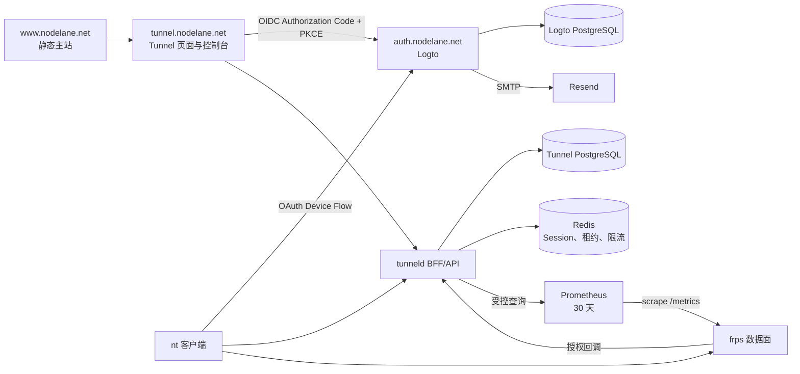

# NodeLane 统一登录与 Tunnel 控制台 MVP 设计

- 日期：2026-09-05
- 状态：对话中的设计段已逐项确认，等待本文档最终审阅
- 总体范围：`D:\Project\nodelane\auth`、`D:\Project\nodelane\nodelane-www`、`D:\Project\nodelane\nodelane-tunneld`
- 实施状态：未开始

## 1. 目标

为 NodeLane 建立可供未来所有子产品复用的统一身份服务，并在 Tunnel 子产品内交付永久命名路由、网页管理、浏览器授权的 `nt` 登录、无需预安装或预登录的一键启动命令，以及 30 天流量统计。

设计必须保留匿名模式，尽量复用成熟开源能力，不建设邮件服务器，不把 Tunnel 业务错误地放入全站账户中心，也不为尚未存在的套餐或权益提前建设复杂系统。

## 2. 已确认需求

### 2.1 身份与产品边界

- **AUTH-01**：登录方式为邮箱验证码和 Google；不提供密码登录。
- **AUTH-02**：统一身份服务面向 NodeLane 全站，未来子产品通过 OIDC 接入同一身份源。
- **AUTH-03**：邮箱验证码由 Resend 发送，不自建邮件服务。
- **AUTH-04**：邮箱身份与 Google 身份只允许用户主动绑定，不因邮箱字符串相同自动合并。
- **AUTH-05**：`auth.nodelane.net` 只负责身份、SSO、OIDC、Device Flow、身份绑定和退出，不保存 Tunnel 路由或流量数据。
- **AUTH-06**：MVP 不建设 `account.nodelane.net`。Logto 内置身份设置只承担身份绑定等全局身份操作。
- **AUTH-07**：`www.nodelane.net` 保持静态，不显示实时登录状态；其登录入口指向 Tunnel 控制台，由 Logto SSO 决定是否需要再次验证。

### 2.2 永久路由

- **ROUTE-01**：注册用户可以在 Tunnel 控制台选择 `demo.tunnel.nodelane.net` 形式的永久子域名。
- **ROUTE-02**：MVP 永久路由只支持 HTTP，公开地址使用 `http://`。HTTPS 只显示“正在规划”，不能生成或暗示已可用。
- **ROUTE-03**：每个账户最多拥有 5 条未删除的永久路由。该值是安全上限，不是套餐权益。
- **ROUTE-04**：永久路由定义和已启动运行都没有产品层面的时间上限。
- **ROUTE-05**：同一永久路由同时最多存在一个活动运行，第二次启动必须被拒绝。
- **ROUTE-06**：停止当前运行不删除永久路由，也不释放域名或账户名额。
- **ROUTE-07**：只有删除永久路由才开始释放流程。删除会先停止当前运行。
- **ROUTE-08**：删除后的域名进入 7 天隔离期，原账户可以恢复；隔离期间不计入 5 条上限，但其他账户不能注册。
- **ROUTE-09**：恢复时必须仍有空余名额。7 天期满后域名可被其他账户注册，原路由不可再恢复。
- **ROUTE-10**：用户自有域名、TCP/UDP 永久路由和 TLS 终止均不属于 MVP。

### 2.3 启动码与客户端登录

- **LAUNCH-01**：每次点击复制永久路由的一键命令时生成一个新的启动码。
- **LAUNCH-02**：启动码有效期为 10 分钟，成功兑换后只能使用一次。
- **LAUNCH-03**：启动码只授予“启动指定的一条永久路由”的权限，不代表整台设备登录账户。
- **LAUNCH-04**：启动命令必须可在未安装 `nt`、也未执行 `nt login` 的新机器上完成安装或更新并直接启动。
- **LAUNCH-05**：一次性命令不能读取、创建、覆盖或退出本机已有的 `nt login` 状态。
- **CLI-01**：`nt login` 使用标准 OAuth 2.0 Device Authorization Grant，通过网页完成授权并持久登录当前设备。
- **CLI-02**：已登录的 `nt` 可以列出账户已有路由并启动其中一条，但不能创建、删除或恢复永久路由。
- **CLI-03**：本地 `Ctrl+C` 可以停止当前进程启动的运行；网页可以远程停止活动运行。
- **CLI-04**：命令入口显式区分匿名、账户和一次性授权，不保留旧式 `nt http localhost 3000` 隐含形式。

### 2.4 匿名模式

- **ANON-01**：匿名模式继续支持当前 HTTP、TCP、UDP 临时隧道。
- **ANON-02**：匿名隧道每次运行最长 1 小时。
- **ANON-03**：复制匿名命令不创建服务端数据；`nt` 必须先完成协议适配的本地预检，再申请公网资源。HTTP/TCP 需要建立本地连接；UDP 只能验证地址解析和本地 UDP socket 可建立，不能声称已证明服务正在监听。
- **ANON-04**：匿名账户、Token、预约和运行不写入 PostgreSQL，只保存在 Redis 的短期状态中。
- **ANON-05**：匿名模式没有网页历史和逐隧道长期流量统计，当前运行统计继续由本地 `nt` 展示。
- **ANON-06**：不兼容旧匿名客户端凭据和旧 API。

### 2.5 流量与页面

- **STAT-01**：注册用户可以查看永久路由最近 24 小时、7 天和 30 天的入站、出站流量。
- **STAT-02**：时序流量只保留 30 天；账户、永久路由、运行历史和审计事件不随流量过期。
- **STAT-03**：MVP 只统计字节，不保存或展示 HTTP URL、Header、Body、响应内容或访客 IP 历史。
- **STAT-04**：流量数据用于观察和排障，不作为账单级计量。
- **UI-01**：主站、登录页、Tunnel 落地页和 Tunnel 控制台共享 NodeLane 视觉语言，但保持产品职责分离。
- **UI-02**：Tunnel 控制台拥有路由列表、创建、详情、启动命令、流量、停止、删除和恢复功能。
- **UI-03**：所有现有 12 种语言、RTL、键盘操作、移动端和 reduced-motion 支持必须保留。

### 2.6 发布边界

- **MIG-01**：本次是破坏性大版本，不进行旧数据导入、新旧表双写、旧 API 保留或数据库升级兼容。
- **MIG-02**：生产环境采用明确停机、备份、删库重建和全量发布。
- **MIG-03**：新数据库从 Goose 第一版迁移初始化，后续版本开始使用增量迁移。
- **MIG-04**：删除生产数据库只能作为单独、人工确认的部署步骤；应用启动不得隐式删库。
- **SCOPE-01**：本轮不做许可证评估。

## 3. 明确不做

- 不建设自有验证码生成、邮件投递、社交登录或 Device Flow 协议。
- 不建设全站业务门户，不把 Tunnel 路由放进身份中心。
- 不提供网页远程启动；网页只生成命令和停止已有运行。
- 不允许 CLI 创建、删除或恢复永久路由。
- 不提供 HTTPS、用户自有域名、永久 TCP/UDP 路由、套餐、付费、配额购买或权限等级界面。
- 不保留匿名网页历史、匿名逐隧道 Prometheus 指标或 HTTP 请求明细。
- 不保证旧版 `nt`、旧匿名凭据、旧数据库或旧 API 可以继续使用。

## 4. 总体架构



### 4.1 域名和所有权

| 域名 | 代码或部署目录 | 职责 |
| --- | --- | --- |
| `www.nodelane.net` | `nodelane-www` | 产品发现、静态登录入口、统一品牌 |
| `auth.nodelane.net` | `auth` | Logto 部署、品牌资源、连接器和 OIDC 配置 |
| `tunnel.nodelane.net` | `nodelane-tunneld` | Tunnel 落地页、控制台、BFF、API、安装器和隧道控制面 |
| `account.nodelane.net` | 不建设 | 未来全局账户门户预留 |

`auth` 目录不复制完整 Logto 源码。默认采用固定版本容器和配置/主题覆盖；只有官方扩展点无法满足已确认需求时才允许维护最小补丁，并记录补丁与上游升级路径。

Logto 和 Tunnel 可以使用同一 PostgreSQL 服务器，但必须使用不同数据库、不同数据库账号和独立迁移生命周期。Prometheus、frps Dashboard/metrics 和 Logto Admin Console 只允许从回环地址、VPN 或受信管理网络访问。

### 4.2 会话边界

每个子产品使用自己的 host-only Cookie，不创建覆盖 `.nodelane.net` 的全域 Cookie。统一登录来自 Logto 的 SSO 会话，而不是跨子域共享应用 Cookie。

Tunnel 浏览器 Cookie 只保存不可预测的 Session ID，OIDC Token 使用独立 Session Encryption Key 进行 AEAD 加密后保存在服务端 Redis Session。主站保持静态并始终显示固定的“登录 / Tunnel 控制台”入口。

Tunnel 页面继续由 Astro 静态构建并嵌入现有 Go 服务，不新增 Node SSR 运行时。Go 在提供 `/console` 静态壳和同源 JSON API 之前执行 Session 保护；未登录访问控制台时进入 OIDC 登录，前端不承担 Token 保存或授权判断。

## 5. 身份设计

### 5.1 Logto 配置

创建三个逻辑资源：

1. `nodelane-tunnel-web`：机密 Web 应用，回调位于 Tunnel BFF，使用 Authorization Code、PKCE、`state` 和 `nonce`。
2. `nodelane-nt`：无客户端密钥的 Native 应用，只启用 Device Authorization Grant。
3. `https://tunnel.nodelane.net/api`：Tunnel API Resource，至少定义 `routes:read` 与 `runs:start` Scope。

登录体验只启用邮箱验证码和 Google。邮箱通过 Logto SMTP Connector 连接 Resend：

- Host：`smtp.resend.com`
- Port：`465`
- TLS：隐式 TLS
- Username：`resend`
- Password：轮换后的 Resend API Key
- Sender：`NodeLane <auth@nodelane.net>`

发件人显示名和本地部分属于部署配置，可以在不改业务代码的情况下调整；发件域固定为已验证的 `nodelane.net`。

### 5.2 本地账户投影

Tunnel 在首次成功登录时创建本地 `tunnel_accounts` 投影。唯一身份键为 OIDC `issuer + subject`，邮箱只用于展示，不参与归属判断或去重。

Google 与邮箱身份的绑定由用户在 Logto 身份设置中主动完成。即使两个身份返回相同邮箱，Tunnel 也不能自行合并本地账户。

### 5.3 `nt login`

`nt login` 直接使用 Logto 的 Device Authorization Endpoint，不通过 Tunnel 自建中间设备码。客户端显示用户码、验证地址和过期时间，并在可用时打开浏览器；无 GUI 环境仍可复制地址到其他设备完成授权。

Refresh Token 优先存入系统凭据库。Windows 使用 Credential Manager；Linux 使用 Secret Service。无图形会话或无 Secret Service 时，允许回退到用户配置目录中的 `0600` 文件，并明确提示安全级别降低。`nt logout` 调用撤销端点并删除本地凭据。

## 6. 持久数据模型

新数据库不沿用现有 `clients`、`client_tokens`、`tunnels` 表。第一版 Goose 迁移直接创建下列新模型。

### 6.1 `tunnel_accounts`

- `id UUID PRIMARY KEY`
- `identity_issuer TEXT NOT NULL`
- `identity_subject TEXT NOT NULL`
- `created_at TIMESTAMPTZ NOT NULL`
- `last_seen_at TIMESTAMPTZ NOT NULL`
- 唯一约束：`(identity_issuer, identity_subject)`

### 6.2 `tunnel_routes`

- `id TEXT PRIMARY KEY`，使用不可枚举的 `rte_` 前缀 ID
- `account_id UUID NOT NULL`
- `protocol TEXT NOT NULL`，MVP 只允许 `http`
- `subdomain TEXT NOT NULL`，只保存标签 `demo`
- `proxy_name TEXT NOT NULL`，稳定且不包含域名或账户信息
- `status TEXT NOT NULL`，数据库值为 `active` 或 `deleted`
- `created_at`、`updated_at`、`deleted_at`
- `recoverable_until TIMESTAMPTZ NULL`
- `name_released_at TIMESTAMPTZ NULL`

逻辑状态按字段派生：

- `ACTIVE`：`status=active`
- `DELETED_RECOVERABLE`：已删除、当前时间不晚于 `recoverable_until`、名称尚未释放
- `RELEASED`：名称已释放，路由保持删除且不可恢复

对子域名建立大小写无关的部分唯一约束，只约束 `name_released_at IS NULL` 的记录。这样隔离期阻止抢注，期满释放后又不需要删除历史路由行。

### 6.3 `route_launch_codes`

- `id TEXT PRIMARY KEY`，使用 `nlc_` 前缀
- `route_id TEXT NOT NULL`
- `secret_hash TEXT NOT NULL`
- `created_at`、`expires_at`、`redeemed_at`、`revoked_at`
- `client_nonce TEXT NULL`，用于同一客户端的幂等兑换

数据库只保存 HMAC-SHA-256 哈希。每次复制生成新码；不同启动码可以同时处于未使用状态。路由删除时撤销所有未使用码。

### 6.4 `tunnel_runs`

- `id TEXT PRIMARY KEY`，使用 `run_` 前缀
- `route_id TEXT NOT NULL`
- `started_via TEXT NOT NULL`：`device_login` 或 `launch_code`
- `status TEXT NOT NULL`：`starting`、`online`、`stopping`、`offline`
- `desired_state TEXT NOT NULL`：`running` 或 `stopped`
- `request_ip INET NOT NULL`
- `connected_ip INET NULL`
- `created_at`、`connected_at`、`last_heartbeat_at`、`stop_requested_at`、`stopped_at`
- `stop_reason TEXT NULL`

部分唯一索引保证同一路由在 `starting`、`online`、`stopping` 中最多有一行。创建运行、占用唯一活动槽和消费启动码必须处于同一数据库事务。

### 6.5 `run_credentials`

- `id TEXT PRIMARY KEY`
- `run_id TEXT NOT NULL UNIQUE`
- `secret_hash TEXT NOT NULL`
- `created_at TIMESTAMPTZ NOT NULL`
- `revoked_at TIMESTAMPTZ NULL`

运行凭据为随机不透明 Bearer Token，只能控制一个 `run_id`，不提供路由列表或账户权限。明文只返回给当前 `nt` 进程并保存在内存中；停止后撤销。

该表只保存注册路由的运行凭据。匿名运行凭据的 ID、哈希和有效期只保存在 Redis。

### 6.6 `tunnel_audit_events`

记录账户、路由、运行、动作、结果、请求 ID、来源类型、时间和必要的脱敏网络信息。审计事件不保存 Token、验证码、Cookie、Refresh Token 或完整命令。

### 6.7 `network_bans`

保留面向运营安全的持久 CIDR 封禁能力，字段包括网络、作用域、原因、创建时间和可选过期时间。它不是匿名会话或匿名身份记录，不随 Redis 临时状态清理。

### 6.8 配额策略边界

MVP 使用一个小型 `RoutePolicyProvider` 边界返回 `max_routes=5` 和允许协议集合 `{http}`。默认实现读取服务端配置，不建立套餐、权益或订阅表。未来可以替换策略提供者而不修改路由事务和 API 形状。

## 7. 生命周期与并发

### 7.1 永久路由

```text
ACTIVE --删除--> DELETED_RECOVERABLE --7天--> RELEASED
  ^                    |
  +------恢复----------+
```

- 删除活动路由时，事务先标记路由删除并设置 `recoverable_until`，同时把当前运行设为期望停止并撤销未使用启动码。
- 删除后立即释放账户 5 条上限中的一个名额，但域名仍保持唯一占用。
- 恢复操作锁定账户与路由，确认仍在 7 天内且账户未达到 5 条，再恢复为 `active`。
- 名称释放采用事务内的惰性检查加后台清理，两者必须使用同一唯一约束防止并发抢注。

### 7.2 运行

```text
STARTING --frps确认--> ONLINE --停止请求--> STOPPING --确认断开--> OFFLINE
    |                       |                                  ^
    +------启动失败---------+------客户端退出/租约超时---------+
```

注册运行没有硬性时长。`nt` 每约 5 秒并带抖动发送心跳，同时读取 `desired_state`。心跳丢失 90 秒后运行转为离线并撤销凭据；90 秒内允许同一运行凭据恢复网络连接。

网页停止把 `desired_state` 设为 `stopped`。frps 插件随后拒绝该运行的新 Ping、NewWorkConn 和代理授权，`nt` 在下一次心跳读取停止状态并关闭嵌入式 frpc。正常网络下，从点击网页停止到公网入口不可访问且 `nt` 退出的目标不超过 15 秒。

### 7.3 启动码

```text
ISSUED --成功兑换--> REDEEMED
   |--10分钟-------> EXPIRED
   +--路由删除-----> REVOKED
```

兑换时按顺序锁定启动码、路由和活动运行槽。若路由已有活动运行，返回 `run_already_active` 且不消费启动码。成功兑换、创建运行和创建运行凭据必须原子提交。

客户端为兑换请求生成 nonce。成功响应使用独立 Idempotency Encryption Key 进行 AEAD 加密，并在 Redis 中按“启动码 ID + nonce”缓存 2 分钟。窗口内，相同启动码与相同 nonce 的网络重试返回同一运行和凭据；不同 nonce 在首次成功后收到 `launch_code_used`。缓存到期后不再恢复凭据明文，客户端必须回到网页生成新启动码。Redis 中不保存可直接读取的运行凭据明文。

## 8. 匿名模式

匿名命令在浏览器中根据协议、本地地址、端口和操作系统生成，复制本身不访问创建 API。

`nt anonymous` 的顺序固定为：

1. 解析并验证参数。
2. 执行本地预检：HTTP/TCP 建立连接；UDP 验证地址解析并建立本地 UDP socket。
3. 生成或读取本地安装实例 ID。
4. 带 Idempotency Key 请求匿名预约。
5. 获得随机公网资源和运行凭据。
6. 启动嵌入式 frpc，并续租心跳。

Redis 状态和默认限制：

- 待连接预约 TTL：2 分钟
- 心跳租约 TTL：90 秒，正常心跳续租
- 单次运行硬上限：1 小时，不允许续期越过该上限
- 每安装实例同时最多 1 条
- 每 IPv4 地址或 IPv6 `/64` 同时最多 2 条
- 每安装实例每 10 分钟最多成功分配 5 次
- 每网络键每 10 分钟最多成功分配 20 次

限流响应携带 `Retry-After`，CLI 显示剩余等待时间和可执行操作。正常退出立即释放；崩溃、断网或未连接预约由 TTL 回收。安装实例 ID 可被用户删除，因此网络限制是必要的第二道约束；这些限制用于控制资源与状态膨胀，不作为强身份防滥用承诺。

匿名代理使用 `anon_` 前缀。其逐代理指标在 Prometheus 抓取阶段丢弃，只保留必要的服务级总量指标。

## 9. API 与授权

### 9.1 浏览器认证端点

- `GET /auth/login`
- `GET /auth/callback`
- `POST /auth/logout`
- `GET /api/v1/session`

浏览器写请求同时校验 host-only Session、CSRF Token、`Origin` 和 Content-Type。OIDC 回调验证 `state`、`nonce`、issuer、audience、签名和时间声明。

### 9.2 Tunnel 资源端点

- `GET /api/v1/routes`
- `POST /api/v1/routes`
- `GET /api/v1/routes/{id}`
- `DELETE /api/v1/routes/{id}`
- `POST /api/v1/routes/{id}/restore`
- `POST /api/v1/routes/{id}/launch-codes`
- `POST /api/v1/routes/{id}/runs`
- `POST /api/v1/routes/{id}/runs/current/stop`
- `GET /api/v1/routes/{id}/traffic?range=24h|7d|30d`

### 9.3 非 Session 端点

- `POST /api/v1/launch/redeem`
- `POST /api/v1/anonymous/runs`
- `POST /api/v1/runs/{id}/heartbeat`
- `POST /api/v1/runs/{id}/stop`

### 9.4 权限矩阵

| 操作 | 网页 Session | 已登录 `nt` | 启动码 | 运行凭据 | 匿名 |
| --- | ---: | ---: | ---: | ---: | ---: |
| 查看永久路由 | 是 | 是 | 否 | 否 | 否 |
| 创建、删除、恢复 | 是 | 否 | 否 | 否 | 否 |
| 生成启动码 | 是 | 否 | 否 | 否 | 否 |
| 启动账号路由 | 否 | 是 | 仅绑定路由 | 否 | 否 |
| 网页远程停止 | 是 | 否 | 否 | 否 | 否 |
| 停止自身运行 | 否 | 否 | 否 | 是 | 是 |
| 创建匿名运行 | 否 | 否 | 否 | 否 | 是 |

所有按账户访问的资源都先按当前 `account_id` 限定查询。跨账户访问与不存在统一返回 `404 route_not_found`，不泄露资源存在性。

### 9.5 错误契约

所有 API 错误使用统一 JSON envelope：`{"error":{"code":"...","message":"...","request_id":"..."}}`。`message` 可以本地化，客户端逻辑只能依赖稳定的 `code`。

至少固定以下错误码：

- `invalid_request`（400）
- `unauthorized`（401）
- `insufficient_scope`（403）
- `route_not_found`（404）
- `subdomain_invalid`（400）
- `subdomain_reserved`（409）
- `subdomain_conflict`（409）
- `route_limit_reached`（409）
- `route_deleted`（409）
- `run_already_active`（409）
- `launch_code_expired`（410）
- `launch_code_used`（410）
- `launch_code_revoked`（410）
- `rate_limited`（429，必须带 `Retry-After`）
- `dependency_unavailable`（503）

创建路由、启动运行、兑换启动码和匿名分配必须接收 Idempotency Key 或客户端 nonce，并以数据库唯一约束或 Redis 原子操作作为最终保证；不能只依赖进程内互斥锁。

## 10. `nt` 命令与凭据

MVP 公共命令模型：

```text
nt
nt anonymous http localhost 3000
nt login
nt logout
nt routes
nt start demo localhost 3000
nt launch <一次性启动码> localhost 3000
```

- 裸运行 `nt` 显示“匿名使用 / 登录账号”选择。
- `nt start` 只接受已登录设备，路由参数可以是唯一子域名标签或路由 ID。
- `nt launch` 只使用启动码，不读取或改变设备登录凭据。
- 账号 Access Token 只发送到 `tunneld` API，绝不放入 frp metadata。
- frps 只接收运行级凭据。运行凭据不能换取账户 Token，也不能启动第二条路由。
- `Ctrl+C` 使用运行凭据调用停止接口，随后关闭本地 frpc；即使停止回报失败，本地进程也必须结束，服务端由心跳超时回收。

Linux、PowerShell 和 CMD 启动器都必须接收并安全传递剩余参数。网页展示的精确命令字符串是验收对象，不能用另一个 shell 的等价命令替代。

## 11. Tunnel 页面与交互

### 11.1 页面地图

| 页面 | 职责 |
| --- | --- |
| `/` | Tunnel 介绍、匿名快速开始、登录管理入口 |
| `/console/tunnels` | 永久路由列表、使用数量、活动状态、最近删除标签 |
| `/console/tunnels/new` | 子域名选择和 HTTP 路由创建 |
| `/console/tunnels/{id}` | 命令、运行状态、流量、停止和删除 |
| `/console/tunnels?view=deleted` | 7 天内的删除项、倒计时和恢复 |

MVP 不设置只有一个业务模块的侧边栏；继续使用 NodeLane 顶部导航，并在控制台内使用“永久隧道 / 最近删除”紧凑导航。

### 11.2 子域名输入

- 输入只接收标签，固定展示 `.tunnel.nodelane.net` 后缀。
- 长度为 3–32 个字符。
- 只允许小写 ASCII 字母、数字和连字符。
- 必须以字母或数字开头、结尾。
- 不接受 Unicode、Punycode、点号或完整域名。
- 至少保留：`www`、`auth`、`api`、`admin`、`console`、`status`、`support`、`mail`、`smtp`、`frp`、`tunnel`。
- 即时可用性检查只提供提示，最终结果由创建事务和唯一约束决定。

达到 5 条时禁用创建按钮并解释为“当前安全上限”，不出现免费、付费、套餐、升级或权益承诺。

### 11.3 详情页

详情页按顺序显示：

1. 永久域名和路由状态。
2. 当前运行状态。
3. 本地地址、端口与 Linux/PowerShell/CMD 命令。
4. 24 小时、7 天、30 天流量。
5. 停止操作。
6. 与停止视觉分离的删除危险区。

点击复制时才请求启动码。成功后显示 10 分钟倒计时和单次使用提示；剪贴板失败时显示可手动选择的命令。已有活动运行时禁止生成新启动命令，并提示先停止当前运行。

删除确认框显示完整域名，并明确说明会停止当前运行、进入 7 天保留期并立即释放账户名额。恢复入口位于最近删除标签中。

### 11.4 状态和视觉

路由和运行界面至少覆盖：从未运行、正在连接、在线、正在停止、离线、已删除可恢复、已释放、启动码生成中、已复制、已过期、已使用、统计加载、暂无数据、统计不可用、登录失效、域名冲突和停止超时。

主站与 Tunnel 落地页采用 Persuade 模式，控制台采用 Operate 模式。复用现有深蓝黑背景、NodeLane 标识、字体、间距和稀缺薄荷绿色信号。登录页使用同一品牌资源，但不把 Logto 界面伪装成 Tunnel 业务页。

## 12. 流量统计

frps `0.70.0` 开启仅监听回环地址的 Web Server 与 `enablePrometheus=true`。Prometheus 每 15 秒抓取 `/metrics`，保存 30 天。

使用 frp 原生 Counter：

- `frp_server_traffic_in_total{name,type}`
- `frp_server_traffic_out_total{name,type}`

注册路由的 `proxy_name` 在多次运行之间稳定，且只包含不可读路由 ID。Prometheus 标签中不得出现账户 ID、邮箱、真实域名、IP 或凭据。匿名 `anon_` 逐代理序列通过 metric relabel 丢弃。

方向定义和验收：

- 入站：公网访问者发送到本地服务的字节。
- 出站：本地服务返回公网访问者的字节。
- 必须使用已知请求体和响应体做黑盒验证，不能仅按指标名称认定方向。

查询分辨率：

| 范围 | PromQL 聚合窗口/步长 | 最大点数 |
| --- | --- | ---: |
| 24 小时 | 5 分钟 | 288 |
| 7 天 | 30 分钟 | 336 |
| 30 天 | 2 小时 | 360 |

`tunneld` 使用 `increase()` 处理 Counter 重启，并只向已授权账户返回聚合后的时间桶和总量。浏览器不能直接访问 Prometheus。Prometheus 不可用时，详情页显示统计暂不可用，不影响其他路由操作。

## 13. 安全设计

- 启动码和运行凭据使用至少 256 位随机秘密，并以带独立 Pepper 的 HMAC-SHA-256 哈希保存。
- 浏览器 Session ID、CSRF Token、OAuth `state`、PKCE verifier 和 nonce 使用密码学安全随机源。
- Cookie 必须是 `Secure`、`HttpOnly`、host-only，并设置适合 OIDC 回调的 `SameSite=Lax`。
- Access Token 必须验证签名、issuer、audience、有效期和允许的 Scope；JWKS 缓存必须支持正常密钥轮换。
- 除用户明确请求并在当前页面生成的 10 分钟一次性启动码外，任何前端 HTML、命令、URL、日志、指标和错误响应都不得包含 Resend Key、Google Secret、OIDC Client Secret、Refresh Token、Session 内容、启动码哈希 Pepper、运行凭据或 frps 共享密钥。启动码可以出现在用户复制的命令参数中，但不得进入服务端访问日志或前端遥测。
- Redis 中的 OIDC Session Token 和启动兑换幂等响应必须使用不同用途的 AEAD 密钥加密；Redis 只保存匿名和运行凭据哈希，不保存这些凭据明文。
- 启动码签发、兑换、匿名分配、登录回调和子域名检查均配置独立限流。
- 所有请求记录 `X-Request-ID`；安全日志只记录结果、稳定错误码和脱敏标识。
- 真实来源 IP 只信任配置中的反向代理网段。Cloudflare 链路使用 `CF-Connecting-IP` 恢复入口地址，并显式向上游发送 `X-Real-IP`；上线验收读取实际 `nginx -T` 并发起真实请求。
- 先前在沟通中暴露的 Resend Key 必须撤销后重新生成。历史上暴露过的 frps 凭据也必须轮换并同步 `FRP_AUTH_TOKEN`，不能复用旧值。

## 14. 故障降级

| 故障 | 必须表现 |
| --- | --- |
| Resend 不可用 | 邮箱登录显示可重试错误；Google 登录和匿名模式不受影响 |
| Google 不可用 | Google 登录显示提供方错误；邮箱登录和匿名模式不受影响 |
| Logto 不可用 | 新登录、Token 刷新和 `nt login` 失败；匿名模式仍可用 |
| Prometheus 不可用 | 只降级流量区域，不影响路由生命周期和运行 |
| Tunnel PostgreSQL 不可用 | 所有账户路由操作失败关闭，不回退为匿名权限 |
| Redis 不可用 | Web Session、匿名分配、限流和活动租约拒绝新操作；返回稳定服务不可用错误 |
| frps 不可用 | 启动明确失败且不留下永久活动运行；控制面仍可查看和删除路由 |
| `nt` 异常退出 | 公网代理先失效，运行最迟在 90 秒心跳租约后转为离线 |

## 15. 开源复用基线

本节只固定来源、版本、职责和升级边界，不进行许可证分析。

| 组件 | 固定版本与提交 | 使用方式 | NodeLane 维护边界 |
| --- | --- | --- | --- |
| Logto | `v1.43.0` / `d066df7d26d596b6ba7ad0bdfaaecfda9c612226` | 固定容器、自托管 OIDC、邮箱、Google、Device Flow | 配置、品牌、连接器；默认不 Fork |
| Prometheus | `v3.14.0` / `d7598b7141418fa35be2b5ec5d0fefb634199610` | 抓取 frps 指标并保留 30 天 | Compose、scrape/relabel、查询代理 |
| Goose | `v3.28.0` / `43d2d9c819ed6c9ba2b67a86bdf9fc08562495b7` | 嵌入 Go 服务执行版本化 SQL 迁移 | Tunnel 自有 migration 文件 |
| frp | `v0.70.0` | 继续作为唯一数据面并导出指标 | 插件授权、配置和固定升级测试 |
| go-oidc | `v3.21.0` / `c914bd380327a5a3a81403774d1a5d5b73772ce7` | BFF OIDC Discovery、ID Token/JWKS 校验 | 薄适配层 |
| `golang.org/x/oauth2` | `v0.36.0` / `4d954e69a88d9e1ccb8439f8d5b6cbef230c4ef9` | Web OAuth 与 `nt` Device Flow | 薄适配层 |
| go-keyring | `v0.2.8` / `2fb288e584191da8306e42b9f86a697742fca71e` | Windows Credential Manager、Linux Secret Service | 凭据存储抽象与受控文件回退 |
| Resend | 托管服务 | Logto SMTP Connector | 域名、Key、发件人和投递监控 |

每次升级单独提交，先在集成环境验证 OIDC 回调、Device Flow、frps 插件、指标名称和数据库迁移，再允许进入生产。

## 16. 部署与删库重建

生产切换是人工执行的维护窗口，不嵌入普通容器启动命令：

1. 记录并验证当前运行镜像、配置和数据库版本。
2. 停止接受新的匿名预约和账户写操作。
3. 备份旧 Tunnel PostgreSQL、Redis 必要快照和现有部署配置，用于整套旧版本回滚。
4. 停止旧 `tunneld` 与 frps 数据面，确认没有仍被宣称在线的运行。
5. 由运维明确删除并重建 Tunnel 数据库和 Redis namespace。
6. 独立初始化 Logto 数据库，配置邮箱、Google、Web 应用、Native 应用和 API Resource。
7. 使用 Goose 初始化全新的 Tunnel 数据库。
8. 启动 Prometheus、frps、tunneld，再部署主站与 Tunnel 页面。
9. 完成集成与生产验收后恢复公开入口。

回滚不尝试把新表转换回旧表，而是停止新版本、恢复部署前的旧数据库备份与旧镜像。任何生产成功声明都必须基于实际运行镜像和外部黑盒请求，而不是构建结果或候选镜像。

## 17. 验收与证据

### 17.1 身份

- **AC-AUTH-01**：真实 Resend 邮件完成邮箱验证码注册与登录；错误、过期和重复验证码均失败，系统不存在密码入口。
- **AC-AUTH-02**：Google 新用户可登录；已有邮箱用户不会因相同邮箱自动合并，只有主动绑定后两种方式进入同一 `issuer + subject`。
- **AC-AUTH-03**：在 staging 配置第二个临时 OIDC 应用，验证已有 Logto 会话可以完成 SSO 而无需再次输入验证码。
- **AC-AUTH-04**：篡改 `state`、nonce、issuer、audience、签名、时间或 Scope 均被拒绝。
- **AC-AUTH-05**：跨账户读取、停止、删除、恢复、签发启动码和查询流量均返回统一 `404`。

### 17.2 永久路由

- **AC-ROUTE-01**：创建 `demo` 后获得且只获得 `http://demo.tunnel.nodelane.net`；HTTPS 显示正在规划且不可选择。
- **AC-ROUTE-02**：非法、保留、冲突名称均返回稳定错误；并发创建同名只有一个成功。
- **AC-ROUTE-03**：并发创建也不能使账户超过 5 条；在线与离线都计数，删除项不计数。
- **AC-ROUTE-04**：停止运行后域名和名额保持；重新启动仍使用同一公开域名。
- **AC-ROUTE-05**：删除活动路由会停止运行、进入 7 天隔离并释放名额；原账户可恢复，其他账户不可抢注。
- **AC-ROUTE-06**：通过可控时钟越过 7 天后域名可被新路由注册，旧路由不可恢复且历史数据不泄露给新账户。

### 17.3 启动码与客户端

- **AC-LAUNCH-01**：每次复制产生不同启动码；数据库只有哈希；10 分钟后失败；成功使用一次后再次使用失败。
- **AC-LAUNCH-02**：启动码不能列路由、创建路由、启动其他路由或访问账户资料。
- **AC-LAUNCH-03**：活动运行冲突不会消费尚未使用的启动码。
- **AC-LAUNCH-04**：模拟兑换响应丢失后，同一 nonce 在 2 分钟窗口内重试恢复同一逻辑结果，不创建第二个运行；窗口过后不返回旧凭据。
- **AC-CLI-01**：`nt login` 完成真实 Device Flow、重启进程后仍可列出并启动已有路由；`nt logout` 后凭据不可继续使用。
- **AC-CLI-02**：`nt` 账户 Token 无法调用创建、删除、恢复或网页远程停止接口。
- **AC-CLI-03**：`nt launch` 在已有登录和未登录两种机器上行为一致，并且执行后登录状态完全不变。
- **AC-CLI-04**：从产品页面复制的原始 Linux、PowerShell、CMD 命令分别在全新环境完成安装、校验、参数传递和启动。三个结果独立记录，不互相替代。

### 17.4 匿名与运行

- **AC-ANON-01**：重复打开页面和复制匿名命令不会增加 PostgreSQL 行数，也不会创建 Redis 预约。
- **AC-ANON-02**：HTTP/TCP 本地目标不可连接时 `nt` 在请求服务端前失败，数据库和 Redis 均无新状态；UDP 地址或 socket 初始化失败时同样不请求服务端。
- **AC-ANON-03**：HTTP、TCP、UDP 各完成一次真实匿名运行；1 小时硬上限由可控时钟验证且不能续期绕过。
- **AC-ANON-04**：安装实例、IPv4、IPv6 `/64` 并发与速率限制均返回准确 `Retry-After`；不同限制互不误报。
- **AC-ANON-05**：正常退出立即释放；终止进程后预约或运行状态在对应 TTL 内回收。
- **AC-RUN-01**：并发启动同一路由只有一个成功，失败方不会获得可用运行凭据。
- **AC-RUN-02**：网页停止后 15 秒内由外部请求确认公网地址不可访问，并确认实际 `nt` 进程退出；只检查 HTTP API 返回不算通过。
- **AC-RUN-03**：网络短断在 90 秒内可恢复同一运行；超过 90 秒必须离线并要求新授权。

### 17.5 流量与界面

- **AC-STAT-01**：通过已知请求体和响应体分别验证入站、出站方向与容许的采集误差。
- **AC-STAT-02**：frps 重启导致 Counter 归零后，24 小时、7 天和 30 天查询不会产生负数或异常尖峰。
- **AC-STAT-03**：超过 30 天的数据不可查询；永久路由和审计记录仍存在。
- **AC-STAT-04**：Prometheus 停止时流量区域显示降级状态，路由创建、启动、停止和删除继续工作。
- **AC-STAT-05**：Prometheus 中不存在带 `anon_` 代理名称的逐隧道序列，也不存在邮箱、域名、账户或 IP 标签。
- **AC-UI-01**：永久路由列表、空状态、创建、详情、最近删除和所有错误状态在桌面与移动端完成截图验证。
- **AC-UI-02**：键盘路径、焦点、对比度、reduced-motion、12 种语言和 Arabic RTL 均通过检查。
- **AC-UI-03**：全站不再承诺尚未实现的免费/付费权益、HTTPS、稳定证书或其他未来能力。

### 17.6 安全与生产

- **AC-SEC-01**：前端构建产物、数据库明文字段、Redis 可读值、日志、指标和三平台命令经过秘密扫描；除用户主动生成的 10 分钟启动码外，不包含禁止的凭据，且启动码不进入访问日志或遥测。
- **AC-SEC-02**：CSRF、跨 Origin、重放、过期码、伪造账号、资源枚举和并发竞态测试全部失败关闭。
- **AC-SEC-03**：上线前确认旧 Resend Key 和历史暴露的 frps Token 已撤销，新值只存在于密钥管理或部署环境。
- **AC-OPS-01**：空数据库执行全部 Goose migration 成功；重复检查显示无待执行迁移；服务不会在启动时执行删库。
- **AC-OPS-02**：备份恢复演练证明可以整套回退到旧镜像与旧数据库，而非尝试数据降级。
- **AC-OPS-03**：生产验收记录 Logto、Prometheus、frps、tunneld 与 `nt` 的实际版本或镜像摘要。
- **AC-OPS-04**：生产环境重新执行页面上真实展示的 Linux、PowerShell、CMD 命令和实际 OIDC/Resend/Google 流程后，才允许声明上线完成。

### 17.7 测试层级

| 层级 | 证据 |
| --- | --- |
| 单元测试 | 状态机、名称校验、策略、Token 哈希、授权矩阵、时间边界、PromQL 响应转换 |
| 集成测试 | PostgreSQL、Redis、Goose、伪 OIDC/JWKS、伪 Prometheus、并发事务、frps 插件协议 |
| Staging | 真实 Logto、Resend、Google、frps、Prometheus、外部 HTTP 客户端、三平台安装环境 |
| Production | 实际镜像与配置、真实公网域名、真实页面命令、真实停止传播和流量方向 |

### 17.8 需求追踪

| 需求 | 主要验收证据 |
| --- | --- |
| AUTH-01、AUTH-03 | AC-AUTH-01、AC-SEC-03 |
| AUTH-02、AUTH-05、AUTH-06、AUTH-07 | AC-AUTH-03、AC-ARCH-01、AC-ARCH-02 |
| AUTH-04 | AC-AUTH-02 |
| ROUTE-01、ROUTE-02、ROUTE-10 | AC-ROUTE-01、AC-ROUTE-02、AC-UI-03 |
| ROUTE-03 | AC-ROUTE-03 |
| ROUTE-04、ROUTE-05、ROUTE-06 | AC-ROUTE-04、AC-RUN-01、AC-RUN-02、AC-RUN-03 |
| ROUTE-07、ROUTE-08、ROUTE-09 | AC-ROUTE-05、AC-ROUTE-06 |
| LAUNCH-01、LAUNCH-02 | AC-LAUNCH-01 |
| LAUNCH-03 | AC-LAUNCH-02 |
| LAUNCH-04 | AC-CLI-04 |
| LAUNCH-05 | AC-CLI-03 |
| CLI-01 | AC-CLI-01 |
| CLI-02、CLI-03 | AC-CLI-02、AC-RUN-02 |
| CLI-04 | AC-CLI-04 |
| ANON-01、ANON-02 | AC-ANON-03 |
| ANON-03、ANON-04、ANON-05 | AC-ANON-01、AC-ANON-02、AC-ANON-05、AC-STAT-05 |
| ANON-06 | AC-ARCH-03 |
| STAT-01、STAT-02、STAT-03、STAT-04 | AC-STAT-01 至 AC-STAT-05 |
| UI-01、UI-02、UI-03 | AC-UI-01、AC-UI-02、AC-UI-03 |
| MIG-01、MIG-02、MIG-03、MIG-04 | AC-OPS-01、AC-OPS-02、AC-OPS-03、AC-OPS-04 |
| SCOPE-01 | 规格与实施产物不包含许可证评估任务 |

补充的架构验收：

- **AC-ARCH-01**：浏览器网络与 Cookie 检查证明主站无动态 Session、各应用不设置 `.nodelane.net` Cookie、Tunnel Token 不进入浏览器存储。
- **AC-ARCH-02**：路由、运行和流量 API 只存在于 Tunnel 服务；Logto 数据库和身份页面不保存或展示 Tunnel 业务记录，MVP 不部署 `account.nodelane.net`。
- **AC-ARCH-03**：旧 `/api/v1/clients`、旧匿名凭据和旧 `nt http ...` 调用不在兼容矩阵中；新版本只通过已定义的新流程验收。

## 18. 实施拆分

本设计覆盖多个独立但顺序相关的工作流，后续实施计划必须拆成可单独验收的阶段：

1. `auth`：Logto、独立数据库、Resend、Google、品牌、Web/Native/API Resource。
2. `nodelane-tunneld` 数据层：Goose、全新 Schema、Repository、策略和状态机。
3. `nodelane-tunneld` 身份与 API：BFF Session、OIDC 验证、路由 API、启动码和运行授权。
4. 匿名与 frps：Redis-only 匿名状态、插件授权、运行停止和租约。
5. `nt`：显式命令、Device Flow、凭据存储、一次性启动和停止轮询。
6. 流量：frps metrics、Prometheus、查询代理和 30 天保留。
7. 页面：主站入口、Tunnel 落地页、控制台、状态和 12 种语言。
8. 集成、破坏性部署演练、生产删库重建与逐项验收。

每个阶段必须先完成本阶段自动化测试和跨阶段接口契约，再进入下一阶段；生产删库重建只能在 staging 完整验收和回滚演练后执行。

## 19. 部署前输入

以下是运维必须提供的密钥或环境信息，不属于待定产品设计：

- 轮换后的 Resend API Key
- Google OAuth Client ID 与 Client Secret
- Logto Web 应用 Client Secret
- Tunnel Session、启动码哈希和运行凭据哈希所需的独立随机密钥
- Session 与启动兑换幂等缓存各自独立的 AEAD 加密密钥
- 轮换后的 frps `FRP_AUTH_TOKEN`
- Logto 与 Tunnel 两套独立 PostgreSQL DSN
- Redis 连接信息
- `auth.nodelane.net` 证书、DNS 与可信代理配置
- Prometheus 持久卷和满足 30 天数据量的磁盘容量

这些值不得提交到 Git。生产部署文档只记录变量名称、生成方法、轮换步骤和验证方式。
